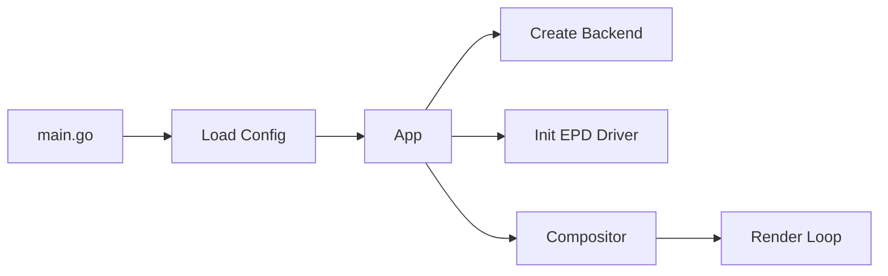
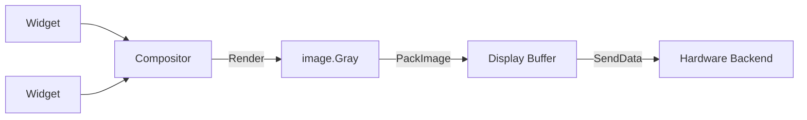
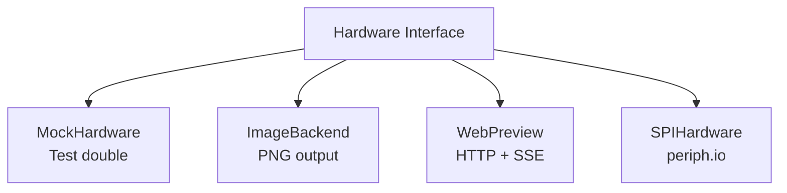

# Inkwell

A Go application for driving e-ink displays on embedded systems.

## Overview

Inkwell controls e-paper displays from a Raspberry Pi via SPI. It provides a
widget-based rendering pipeline that composes UI elements into display buffers
and refreshes the panel.

The project is designed to be 100% testable without hardware. Multiple backends
let you develop and verify display output on your workstation using PNG files or
a live browser preview, then deploy the same binary to a Pi with the real SPI
backend.

Adding support for a new display is a data problem, not a code problem: define
a `DisplayProfile` with the display's resolution, color depth, and command
sequences, and the existing driver handles the rest.

Currently targets the **Waveshare 7.5" e-Paper V2** (800x480, black and white)
on a **Raspberry Pi Zero 2 W**. The compositor renders into a 12-level
grayscale canvas and the buffer packer dithers down to the 1-bit panel via
Bayer-4×4 ordered dithering, so widgets can use soft grays and anti-aliased
text and have them survive on the device as halftone patterns. See
[docs/guides/hardware-grayscale.md](docs/guides/hardware-grayscale.md) for the
rules of thumb on what reads well on the panel.

## Included Widgets

The default registry ships with the following widget types, all configurable
from `inkwell.yaml`:

<!-- markdownlint-disable MD013 -->
| Type | Purpose |
|------|---------|
| `date` | Formatted date header (Go-format strings, e.g. `"Monday, January 2"`). |
| `clock` | Current time, right-aligned variant available. |
| `separator` | Soft horizontal hairline; thickness-configurable. |
| `weekly-calendar` | 7-day calendar + weather dashboard. Fetches events from one or more iCal feeds and forecasts from an Open-Meteo ensemble (GFS / ECMWF / GEM). |
<!-- markdownlint-enable MD013 -->

The weekly calendar widget integrates a built-in iCal parser, an HTTP feed
source with per-feed deduplication, a TTL-based cache, and per-day event /
weather columns with a temperature polyline and precipitation bars. See
[docs/demos/weekly-calendar-dashboard.md](docs/demos/weekly-calendar-dashboard.md)
for the full configuration walkthrough.

## Architecture

### Application Lifecycle



### Rendering Pipeline



### Hardware Backends



All source lives in `internal/inkwell/`. The entry point is `cmd/inkwell/main.go`.
Configuration is loaded from `inkwell.yaml`.

## Quick Start

Prerequisites: Go 1.25+

```bash
git clone https://github.com/grantlucas/inkwell.git
cd inkwell
cp inkwell.example.yaml inkwell.yaml   # start from the bundled example
go run ./cmd/inkwell
```

Open <http://localhost:8080> to see the live web preview. The browser view
defaults to the **device** rendering (post-dither, 1-bit) so what you see
matches what would land on the panel; toggle to **source** for the smooth
grayscale design view.

The bundled `inkwell.example.yaml` wires up a date header, clock, separator
and the weekly calendar + weather widget — a working dashboard out of the
box. Point its `feeds:` at any iCal URL and set `latitude` / `longitude` for
your location.

A minimal `inkwell.yaml` for just the preview backend looks like:

```yaml
display: waveshare_7in5_v2
backend: preview
preview:
  port: 8080
```

For iterating on the calendar widget without a live feed, `cmd/testcal`
serves a synthetic iCal endpoint locally:

```bash
go run ./cmd/testcal   # → http://localhost:9999/test.ics
```

### Installing on a Raspberry Pi

See [docs/guides/installation.md](docs/guides/installation.md) for the
end-to-end workflow: cross-compile from your workstation, deploy the
binary to the Pi via `scp`, configure `inkwell.yaml`, and run as a
systemd service.

### Upgrading

An installed Inkwell can update itself from the latest GitHub
release:

```bash
inkwell --version                  # see what's installed
sudo inkwell self-update --check   # see what's available, no writes
sudo inkwell self-update           # download, sha256-verify, replace
sudo systemctl restart inkwell     # bring the new binary up
```

`sudo` is needed because `/usr/local/bin/inkwell` is owned by root
on a default install; `chown` it to the service user if you'd prefer
to run the updater without elevation.

## Supported Hardware

<!-- markdownlint-disable MD013 -->
| Display | Resolution | Color | Refresh Modes |
|---------|-----------|-------|---------------|
| Waveshare 7.5" e-Paper V2 | 800x480 | Black/White | Full, fast, partial, 4-level grayscale |
<!-- markdownlint-enable MD013 -->

To add a new display, define a `DisplayProfile` in `internal/inkwell/profile.go`
and register it in the `Profiles` map. No driver code changes are needed.

## Make Targets

<!-- markdownlint-disable MD013 -->
| Target | Description |
|--------|-------------|
| `make test` | Run tests with race detection and coverage |
| `make coverage` | Run tests and enforce 100% statement coverage |
| `make build` | Build for the host platform |
| `make build-pi` | Cross-compile for Raspberry Pi (linux/arm64, no CGO) |
| `make run` | Build and run locally with the preview backend |
| `make stop` | Stop a running inkwell process (matches the binary, not the source path) |
| `make verify` | `go mod verify` |
| `make vet` | `go vet ./...` |
| `make ci` | Full CI pipeline: verify, vet, coverage, build-pi |
| `make fix` | Run `go fix` to modernize code |
| `make lint` | Lint all markdown files |
| `make help` | Show all available targets |
<!-- markdownlint-enable MD013 -->

## Documentation

The `docs/` directory contains detailed reference material:

- **Guides** ([docs/guides/](docs/guides/)) — user-facing how-tos:
  - [Installation on a Raspberry Pi](docs/guides/installation.md)
  - [Building dashboards](docs/guides/building-dashboards.md)
  - [Hardware grayscale ceilings](docs/guides/hardware-grayscale.md)
- **Tech specs** ([docs/tech-specs/](docs/tech-specs/)) — hardware,
  protocol, and architecture references:
  - Hardware overview, GPIO pin mapping
  - SPI command reference
  - Go implementation architecture
  - Testing strategy
- **Demos** ([docs/demos/](docs/demos/)) — feature-level walkthroughs
  (e.g. the weekly calendar dashboard and the grayscale refresh).

## Contributing

See [CONTRIBUTING.md](CONTRIBUTING.md) for development setup, testing
requirements, and contribution guidelines.
