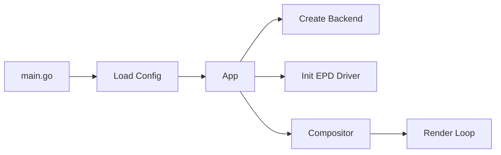
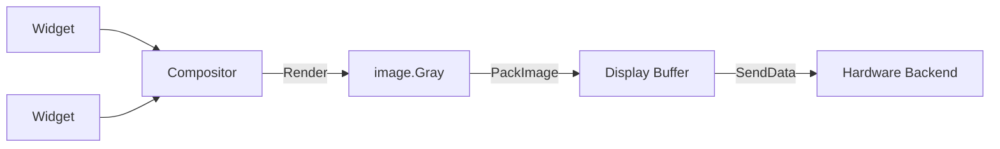
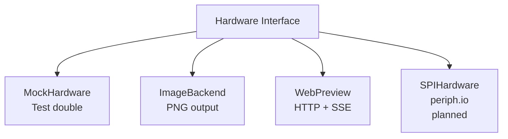

# Inkwell

A Go application for driving e-ink displays on embedded systems.

## Overview

Inkwell controls e-paper displays from a Raspberry Pi via SPI. It provides a
widget-based rendering pipeline that composes UI elements into display buffers
and refreshes the panel.

The project is designed to be 100% testable without hardware. Multiple backends
let you develop and verify display output on your workstation using PNG files or
a live browser preview, then deploy the same binary to a Pi with the real SPI
backend.

Adding support for a new display is a data problem, not a code problem: define
a `DisplayProfile` with the display's resolution, color depth, and command
sequences, and the existing driver handles the rest.

Currently targets the **Waveshare 7.5" e-Paper V2** (800x480, black and white)
on a **Raspberry Pi Zero 2 W**.

## Architecture

### Application Lifecycle



### Rendering Pipeline



### Hardware Backends



All source lives in `internal/inkwell/`. The entry point is `cmd/inkwell/main.go`.
Configuration is loaded from `inkwell.yaml`.

## Quick Start

Prerequisites: Go 1.25+

```bash
git clone https://github.com/grantlucas/inkwell.git
cd inkwell
go run ./cmd/inkwell
```

Open <http://localhost:8080> to see the live web preview.

The default configuration (`inkwell.yaml`) uses the preview backend:

```yaml
display: waveshare_7in5_v2
backend: preview
preview:
  port: 8080
```

## Supported Hardware

<!-- markdownlint-disable MD013 -->
| Display | Resolution | Color | Refresh Modes |
|---------|-----------|-------|---------------|
| Waveshare 7.5" e-Paper V2 | 800x480 | Black/White | Full, fast, partial, 4-level grayscale |
<!-- markdownlint-enable MD013 -->

To add a new display, define a `DisplayProfile` in `internal/inkwell/profile.go`
and register it in the `Profiles` map. No driver code changes are needed.

## Make Targets

<!-- markdownlint-disable MD013 -->
| Target | Description |
|--------|-------------|
| `make test` | Run tests with race detection and coverage |
| `make coverage` | Run tests and enforce 100% statement coverage |
| `make build` | Build for the host platform |
| `make build-pi` | Cross-compile for Raspberry Pi (linux/arm64, no CGO) |
| `make run` | Build and run locally with the preview backend |
| `make ci` | Full CI pipeline: verify, vet, coverage, build-pi |
| `make fix` | Run `go fix` to modernize code |
| `make lint` | Lint all markdown files |
| `make help` | Show all available targets |
<!-- markdownlint-enable MD013 -->

## Documentation

The `docs/` directory contains detailed reference material:

- Hardware overview and GPIO pin mapping
- Raspberry Pi setup guide
- Rendering pipeline and buffer packing
- SPI command reference
- Go implementation guide
- Testing strategy

## Contributing

See [CONTRIBUTING.md](CONTRIBUTING.md) for development setup, testing
requirements, and contribution guidelines.
