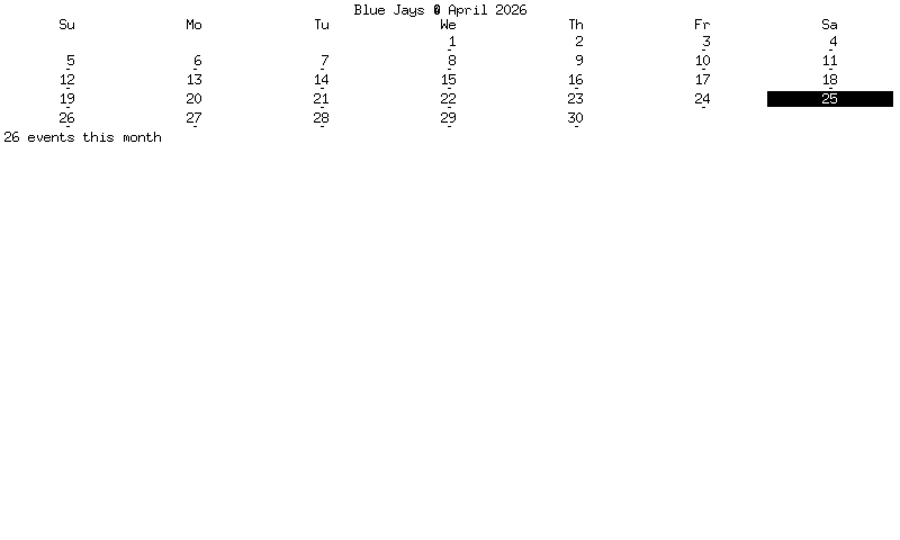
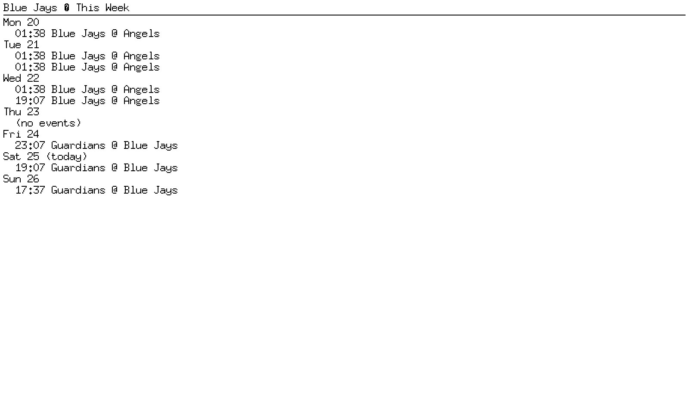
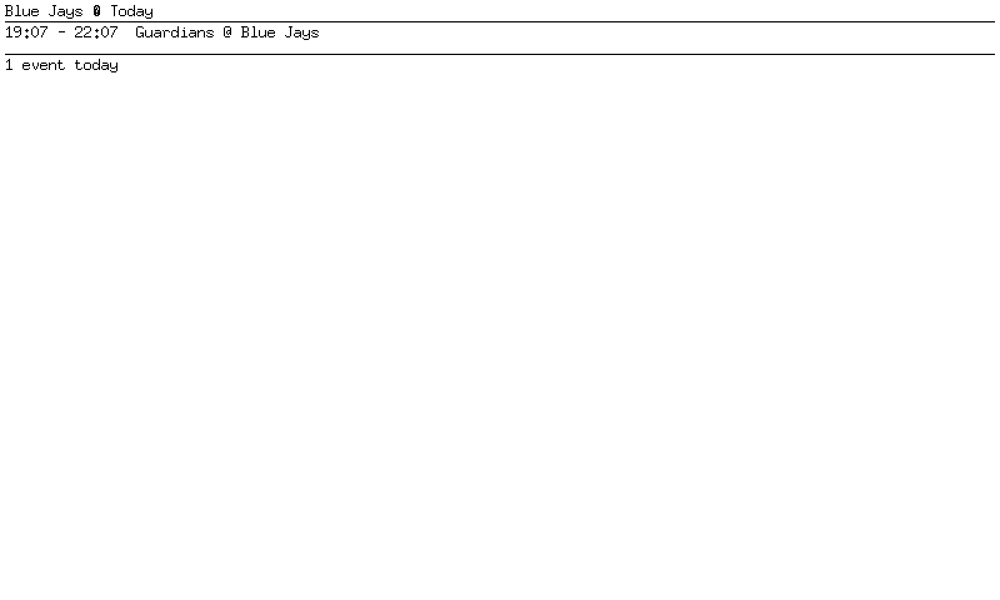
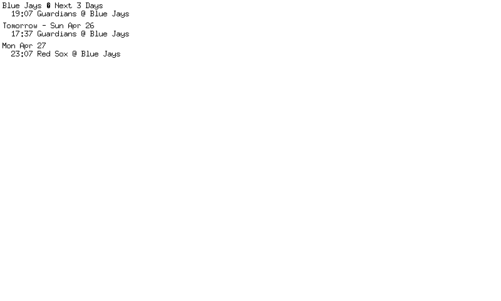

<!-- markdownlint-disable MD010 MD013 -->

# Calendar Widget — iCal Subscription Demo

*2026-04-25T19:34:18Z by Showboat 0.6.1*
<!-- showboat-id: a1a227f0-6f51-452d-ab80-bdf016acb04c -->

The calendar widget ingests iCal (.ics) subscription feeds and renders them on the e-ink display. It supports four view modes — month, week, today, and upcoming (3-day) — each configurable per widget instance in YAML. This demo uses the Toronto Blue Jays MLB schedule as a real-world iCal feed.

## Step 1: Verify the iCal Feed

Let's confirm the Blue Jays calendar subscription is reachable and contains valid VEVENT entries:

```bash
curl -s "https://ics.calendarlabs.com/13/29aac7be/Toronto_Blue_Jays_-_MLB.ics" | head -20
```

```output
BEGIN:VCALENDAR
VERSION:2.0
PRODID:-//Calendar Labs//Calendar 1.0//EN
CALSCALE:GREGORIAN
METHOD:PUBLISH
X-WR-CALNAME:Toronto Blue Jays - MLB
X-WR-TIMEZONE:UTC
BEGIN:VEVENT
UID:gr9vhmioi24t2ctjgt1ghclnfg
DTSTART:20260221T180700Z
DTEND:20260221T210700Z
DTSTAMP:20260420T100012Z
STATUS:CONFIRMED
TRANSP:TRANSPARENT
SEQUENCE:0
PRIORITY:5
X-MICROSOFT-CDO-IMPORTANCE:1
CLASS:PUBLIC
SUMMARY:Phillies (0) @ Blue Jays (3)
DESCRIPTION:Thanks for subscribing! Your calendar is ready and auto-updates with any changes. Discover more exciting calendars at https://calendarlabs.com/ical-calendar
```

```bash
curl -s "https://ics.calendarlabs.com/13/29aac7be/Toronto_Blue_Jays_-_MLB.ics" | grep -c "^BEGIN:VEVENT"
```

```output
179
```

179 games in the feed — a full MLB season. The iCal parser handles DTSTART, DTEND, SUMMARY, LOCATION, UID, and line unfolding per RFC 5545.

## Step 2: Tests and Coverage

All calendar packages maintain 100% statement coverage:

```bash
go test ./... -count=1 2>&1
```

```output
?   	github.com/grantlucas/inkwell/cmd/inkwell	[no test files]
ok  	github.com/grantlucas/inkwell/internal/inkwell	1.562s
ok  	github.com/grantlucas/inkwell/internal/inkwell/calendar	0.539s
ok  	github.com/grantlucas/inkwell/internal/inkwell/calendar/ical	0.323s
ok  	github.com/grantlucas/inkwell/internal/inkwell/testutil	0.750s
ok  	github.com/grantlucas/inkwell/internal/inkwell/widget	0.940s
ok  	github.com/grantlucas/inkwell/internal/inkwell/widgets	1.380s
ok  	github.com/grantlucas/inkwell/internal/inkwell/widgets/calendar	1.643s
ok  	github.com/grantlucas/inkwell/internal/inkwell/widgets/clock	1.826s
```

```bash
go test ./internal/inkwell/... -coverprofile=/tmp/coverage.out -count=1 2>&1 && go tool cover -func=/tmp/coverage.out | grep total
```

```output
ok  	github.com/grantlucas/inkwell/internal/inkwell	0.663s	coverage: 100.0% of statements
ok  	github.com/grantlucas/inkwell/internal/inkwell/calendar	0.486s	coverage: 100.0% of statements
ok  	github.com/grantlucas/inkwell/internal/inkwell/calendar/ical	0.899s	coverage: 100.0% of statements
ok  	github.com/grantlucas/inkwell/internal/inkwell/testutil	1.138s	coverage: 100.0% of statements
ok  	github.com/grantlucas/inkwell/internal/inkwell/widget	0.678s	coverage: 100.0% of statements
ok  	github.com/grantlucas/inkwell/internal/inkwell/widgets	1.325s	coverage: 100.0% of statements
ok  	github.com/grantlucas/inkwell/internal/inkwell/widgets/calendar	1.547s	coverage: 100.0% of statements
ok  	github.com/grantlucas/inkwell/internal/inkwell/widgets/clock	1.729s	coverage: 100.0% of statements
total:											(statements)		100.0%
```

## Step 3: Build the Binary

```bash
go build -o /tmp/inkwell-demo ./cmd/inkwell/ && echo 'Build successful'
```

```output
Build successful
```

## Step 4: Month View

The month view renders a traditional calendar grid. Days with events get a dot indicator, and today is highlighted with an inverted cell. Here is the YAML config:

```bash
cat inkwell.yaml
```

```output
display: waveshare_7in5_v2
backend: preview
preview:
  port: 8080

dashboard:
  screens:
    - name: home
      widgets:
        - type: calendar
          bounds: [0, 0, 800, 480]
          config:
            view: month
            title: "Blue Jays — April 2026"
            feeds:
              - https://ics.calendarlabs.com/13/29aac7be/Toronto_Blue_Jays_-_MLB.ics
            refresh: 15m
            week_start: sunday
```

```bash {image}

```



The month grid shows today highlighted with an inverted cell and dots under days that have games. The title is configurable — here we set it to "Blue Jays — April 2026".

## Step 5: Week View

The week view lists events per day for the current 7-day window. Changing the view is a single YAML edit:

```bash
cat inkwell.yaml
```

```output
display: waveshare_7in5_v2
backend: preview
preview:
  port: 8080

dashboard:
  screens:
    - name: home
      widgets:
        - type: calendar
          bounds: [0, 0, 800, 480]
          config:
            view: week
            title: "Blue Jays — This Week"
            feeds:
              - https://ics.calendarlabs.com/13/29aac7be/Toronto_Blue_Jays_-_MLB.ics
            refresh: 15m
            week_start: monday
            max_events: 3
```

```bash {image}

```



Each day shows its events with start times. The `(today)` marker highlights the current day. `max_events: 3` caps the per-day event list.

## Step 6: Today View

The today view shows a detailed list of events for just today — ideal for a quick glance at the schedule:

```bash
cat inkwell.yaml
```

```output
display: waveshare_7in5_v2
backend: preview
preview:
  port: 8080

dashboard:
  screens:
    - name: home
      widgets:
        - type: calendar
          bounds: [0, 0, 800, 480]
          config:
            view: today
            title: "Blue Jays — Today"
            feeds:
              - https://ics.calendarlabs.com/13/29aac7be/Toronto_Blue_Jays_-_MLB.ics
            refresh: 15m
```

```bash {image}

```



If there is a game today, it shows with start and end times. If not, the widget gracefully shows "No events today" with a zero-event footer.

## Step 7: Upcoming (3-Day) View

The upcoming view shows today plus the next two days — great for seeing what is just around the corner:

```bash
cat inkwell.yaml
```

```output
display: waveshare_7in5_v2
backend: preview
preview:
  port: 8080

dashboard:
  screens:
    - name: home
      widgets:
        - type: calendar
          bounds: [0, 0, 800, 480]
          config:
            view: upcoming
            title: "Blue Jays — Next 3 Days"
            feeds:
              - https://ics.calendarlabs.com/13/29aac7be/Toronto_Blue_Jays_-_MLB.ics
            refresh: 15m
```

```bash {image}

```



Each day gets a header (Today, Tomorrow, or date), and events are listed underneath with start times. Days with no games show "(no events)".

## Step 8: Multiple Subscriptions

The real power is combining multiple iCal feeds into a single view. Here we add a second calendar alongside the Blue Jays:

```bash
cat inkwell.yaml
```

```output
display: waveshare_7in5_v2
backend: preview
preview:
  port: 8080

dashboard:
  screens:
    - name: home
      widgets:
        - type: calendar
          bounds: [0, 0, 800, 480]
          config:
            view: month
            title: "Sports — April 2026"
            feeds:
              - https://ics.calendarlabs.com/13/29aac7be/Toronto_Blue_Jays_-_MLB.ics
              - https://ics.calendarlabs.com/13/f02e3809/Toronto_Raptors_-_NBA.ics
            refresh: 15m
            week_start: sunday
```

```bash {image}

```


Events from both feeds are merged, deduplicated by UID, and sorted by start time. The dot indicators now appear on days with games from either team.

The web preview page shows the calendar as it would appear on the e-ink display:

```bash {image}

```


## Step 9: Config Validation

The factory validates all config values at startup. Invalid configs fail fast with clear errors:

```bash
/tmp/inkwell-demo 2>&1 || true
```

```output
inkwell: build dashboard: screen "home": widget "calendar": calendar: invalid view "quarterly" (must be month, week, today, or upcoming)
```

```bash
/tmp/inkwell-demo 2>&1 || true
```

```output
inkwell: build dashboard: screen "home": widget "calendar": calendar: feeds is required
```

Config errors are caught at startup — no silent failures or confusing runtime crashes.

## Summary

This demo showed the full calendar widget pipeline:

1. **iCal parsing** — fetches and parses real MLB schedule feeds (179 events)
2. **Four view modes** — month grid, week list, today detail, and 3-day upcoming
3. **Multiple feeds** — merge Blue Jays + Raptors into one calendar
4. **Configurable** — title, week start day, max events, refresh interval
5. **Cached** — feeds refresh on a TTL (default 15m), not every render cycle
6. **Validated** — invalid view modes, missing feeds, and bad config caught at startup
7. **100% tested** — all packages at 100% statement coverage with golden PNG tests
