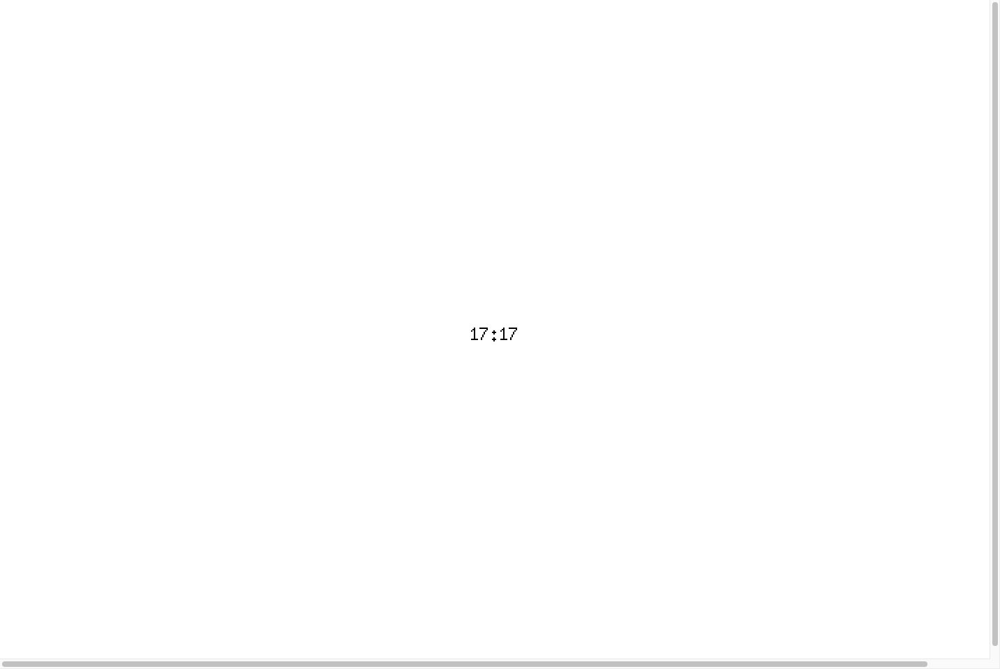

<!-- markdownlint-disable MD010 MD013 MD040 -->

# YAML-Driven Dashboard Configuration

*2026-04-18T21:14:36Z by Showboat 0.6.1*
<!-- showboat-id: 28d364dc-77d9-436b-9b9f-bbfb41c8e399 -->

Inkwell now supports YAML-driven dashboard configuration. Instead of hardcoding widget layouts in Go, you define screens and widgets in `inkwell.yaml`. This walkthrough demonstrates the full pipeline: from YAML config to rendered e-ink display output.

## Step 1: Define a Dashboard in YAML

The config file defines which widgets appear, where they are positioned, and how screens rotate. Here's a single-screen dashboard with a centered clock:

```bash
cat inkwell.yaml
```

```output
display: waveshare_7in5_v2
backend: preview
preview:
  port: 8080

dashboard:
  screens:
    - name: home
      widgets:
        - type: clock
          bounds: [300, 210, 500, 270]
          config:
            format: "15:04"
```

The `bounds` field is `[x0, y0, x1, y1]` matching Go's `image.Rect()`. This places the clock widget centered on the 800×480 display. The `format` config key uses Go's time format strings.

## Step 2: Build and Verify Tests

All new code has 100% statement coverage. Let's confirm everything passes:

```bash
go test ./... -count=1 2>&1
```

```output
?   	github.com/grantlucas/inkwell/cmd/inkwell	[no test files]
ok  	github.com/grantlucas/inkwell/internal/inkwell	1.191s
ok  	github.com/grantlucas/inkwell/internal/inkwell/testutil	0.603s
ok  	github.com/grantlucas/inkwell/internal/inkwell/widget	0.980s
ok  	github.com/grantlucas/inkwell/internal/inkwell/widgets	1.172s
ok  	github.com/grantlucas/inkwell/internal/inkwell/widgets/clock	0.376s
```

```bash
go test ./internal/inkwell/... -coverprofile=/tmp/coverage.out -count=1 2>&1 && go tool cover -func=/tmp/coverage.out | grep total
```

```output
ok  	github.com/grantlucas/inkwell/internal/inkwell	1.552s	coverage: 100.0% of statements
ok  	github.com/grantlucas/inkwell/internal/inkwell/testutil	1.353s	coverage: 100.0% of statements
ok  	github.com/grantlucas/inkwell/internal/inkwell/widget	0.421s	coverage: 100.0% of statements
ok  	github.com/grantlucas/inkwell/internal/inkwell/widgets	0.691s	coverage: 100.0% of statements
ok  	github.com/grantlucas/inkwell/internal/inkwell/widgets/clock	0.908s	coverage: 100.0% of statements
total:										(statements)		100.0%
```

## Step 3: Build and Launch the Preview

Inkwell's web preview backend serves a live display on localhost. Let's build and run it:

```bash
go build -o /tmp/inkwell-demo ./cmd/inkwell/ && echo 'Build successful'
```

```output
Build successful
```

The dashboard config is read from `inkwell.yaml` and the clock widget is instantiated, positioned, and rendered — all from YAML, no Go code changes needed.

```bash {image}

```



The raw frame PNG is also available at `/frame.png?scale=2` for pixel-level inspection. This is exactly what would be sent to the e-ink hardware:

```bash {image}

```


## Step 4: Change the Layout — Just Edit YAML

The power of this system is that changing a layout is a config change, not a code change. Let's move the clock to the top-right corner and switch to 12-hour format:

```bash
cat inkwell.yaml
```

```output
display: waveshare_7in5_v2
backend: preview
preview:
  port: 8080

dashboard:
  screens:
    - name: home
      widgets:
        - type: clock
          bounds: [650, 0, 800, 30]
          config:
            format: "3:04 PM"
```

The clock moved to the top-right corner and now shows 12-hour format — just by editing the YAML, no recompilation needed:

```bash {image}

```


## Step 5: How It Works Under the Hood

The pipeline from YAML to pixels:

```
inkwell.yaml
    │
    ▼
LoadConfig()         Parse YAML into Config struct
    │
    ▼
buildDashboard()     Widget Registry creates widgets by type name
    │                Validates bounds fit within 800×480 display
    ▼
Dashboard            Holds Screen(s), manages rotation timing
    │
    ▼
Screen               Named collection of positioned widgets
    │
    ▼
Compositor.Render()  Draws each widget into a shared frame
    │
    ▼
PackImage()          Converts frame to e-ink binary format
    │
    ▼
EPD.Display()        Sends to hardware (or web preview)
```

Key types introduced:

- **`widget.Registry`** — maps type name strings (e.g. `"clock"`) to factory functions
- **`widget.Factory`** — `func(bounds, config, deps) → Widget`
- **`widget.Deps`** — injectable dependencies (clock, future: HTTP client)
- **`Screen`** — named widget collection (one layout)
- **`Dashboard`** — screen collection with passive rotation

## Step 6: Bounds Validation

Widget bounds are validated against the display profile at startup. If a widget exceeds the display dimensions, Inkwell fails fast with a clear error:

```bash
cat inkwell.yaml | grep -A2 bounds
```

```output
          bounds: [700, 0, 900, 50]
          config:
            format: "15:04"
```

```bash
/tmp/inkwell-demo 2>&1 || true
```

```output
inkwell: build dashboard: screen "home": widget "clock" bounds (700,0)-(900,50) exceed display (0,0)-(800,480)
```

The widget's x1 coordinate (900) exceeds the display width (800), so Inkwell rejects the config immediately rather than rendering a broken frame.

Similarly, referencing a widget type that hasn't been registered gives a clear error:

```bash
/tmp/inkwell-demo 2>&1 || true
```

```output
inkwell: build dashboard: screen "home": widget "weather": unknown widget type: "weather"
```

## Summary

This walkthrough demonstrated the full YAML-driven dashboard pipeline:

1. **Define** — dashboards, screens, and widgets in `inkwell.yaml`
2. **Build** — 100% test coverage, `go build` produces a single binary
3. **Run** — preview server renders the config-defined layout
4. **Iterate** — change bounds or format in YAML, restart, see results instantly
5. **Validate** — bounds checking and type validation catch errors at startup

The system is extensible: adding a new widget means implementing the `Widget` interface, writing a `Factory` function, and registering it — then it's immediately available in YAML config.
