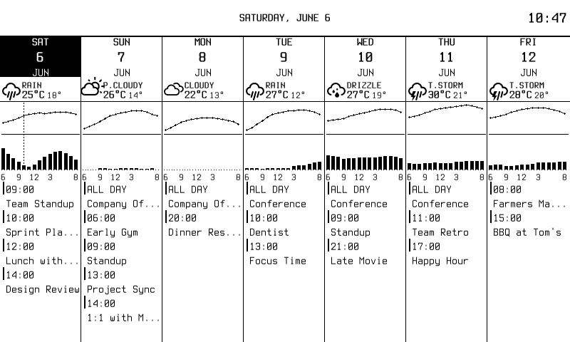
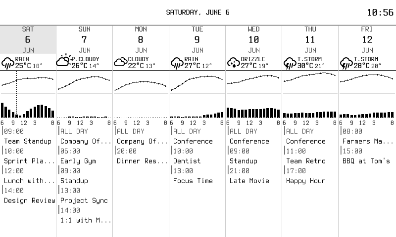
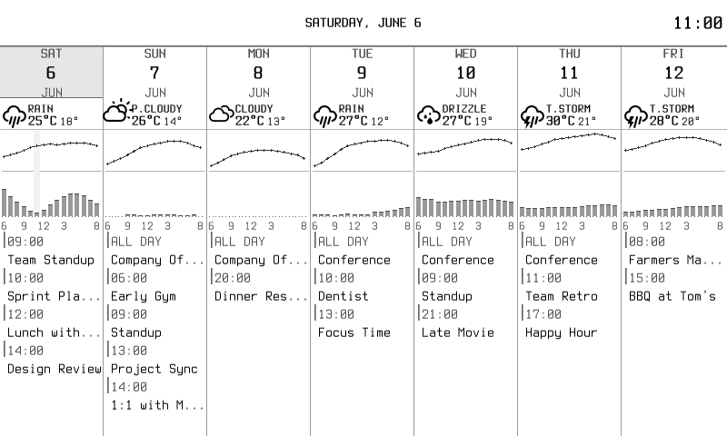
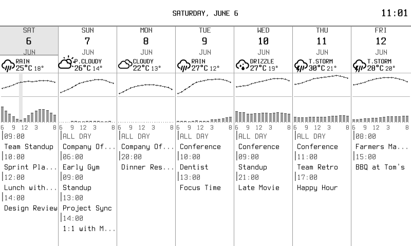
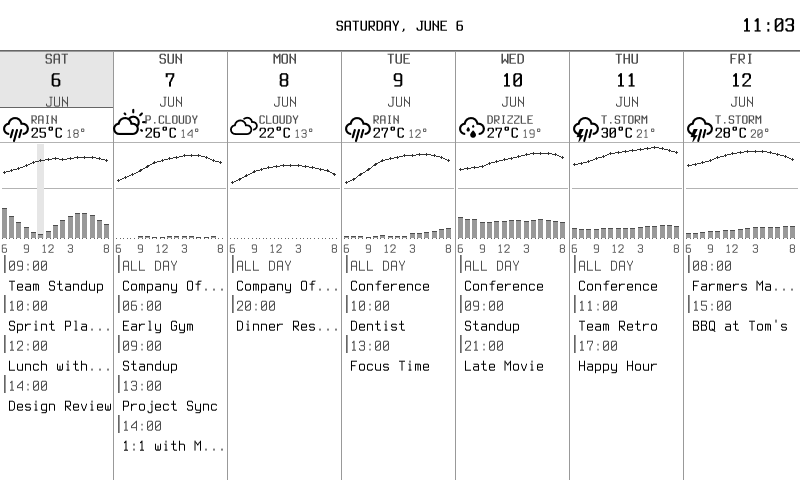
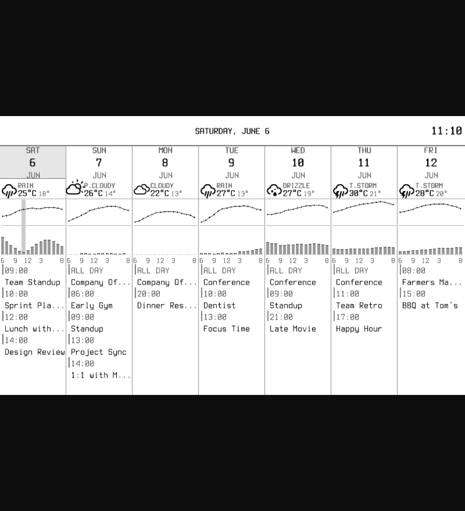
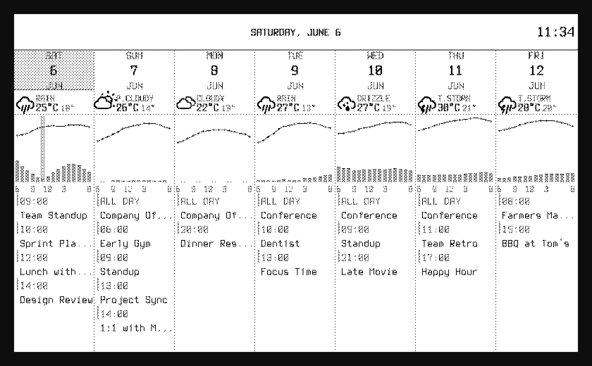
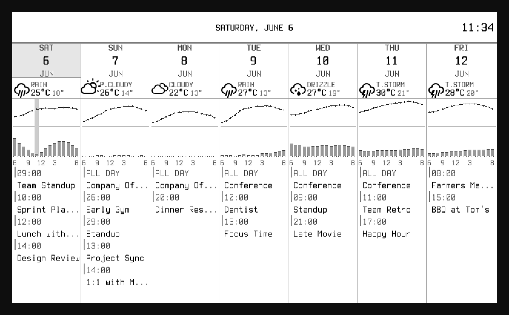

<!-- markdownlint-disable MD013 MD040 -->

# From 1-bit to Grayscale: A Dashboard Visual Refresh

*2026-06-06T15:22:05Z by Showboat 0.6.1*
<!-- showboat-id: efaed283-958c-4cc0-9a32-320317ed373a -->

## Why

The Inkwell dashboard targets the Waveshare 7.5" e-paper panel. The original
compositor produced a strict 2-color paletted frame: every pixel was either
white (palette index 0) or black (palette index 1). Every widget — separator
hairlines, column dividers, today-highlight blocks, weather icons, precip
bars, the temperature polyline, font glyphs — was forced to snap to those
two extremes.

The result was *legible* but visually fatiguing: hard edges everywhere,
no visual hierarchy between primary and secondary content, the today
column blasting from the page as a solid inverse block, dotted hour-marks
that read like noise, and weather icons rendered as 1-bit silhouettes
with staircased curves.

Modern e-paper controllers can dither far smoother input than that. The
goal of this refresh: **render PNGs in proper grayscale, let the e-ink
pipeline dither them down on its own time, and use the intermediate gray
levels deliberately for visual hierarchy.**

## The baseline

Here is the dashboard as it rendered before any of this work landed. Same
data, same layout, same widgets — everything just compressed to two
luminance levels:

```bash {image}

```


## Step 1 — Move the compositor to a 12-level grayscale palette

The single highest-leverage change. The compositor used to build a
`*image.Paletted` whose palette was `{color.White, color.Black}`. Any
intermediate gray produced by anti-aliasing or by an explicit gray fill
would snap to one of those two entries.

A new `PaperPalette` in `internal/inkwell/widget/palette.go` defines
twelve grays: white at index 0, black at index 1, and ten named
intermediates (`PaperGray05` through `PaperGray90`) ramping from
nearly-white to nearly-black. Existing widgets that hard-coded `1` for
black keep working unchanged. The compositor always renders into
`PaperPalette` now — no more 2-color branch.

The packer is unchanged: `packBW` still thresholds by luminance to a
1-bit device buffer; `packGray4` still maps to four levels for the
grayscale device path. The SPI side of the world doesn't notice this
change. A new `FrameSink` capability lets the web-preview backend grab
the pre-pack source frame instead of unpacking the 1-bit buffer, so the
browser preview shows the full grayscale fidelity.

By itself this change does very little visually — the widgets still draw
in pure black on a white background — but it unlocks every step that
follows. Anti-aliased font glyphs, soft separators, gray chart accents:
all of them depend on the destination palette having intermediate
entries to land on.

```bash {image}

```



## Step 2 — Soft separators, soft today highlight, hierarchical type

With the palette in place, the widgets get to use it. Four changes
visible in this step:

1. **Header separator** — was a 2-px solid black slab; now a soft
   `PaperGray40` base row with a slightly darker `PaperGray60` edge
   accent on top. Same structural cue, no longer a hard divider.
2. **Today highlight** — was a solid black rectangle with inverted white
   text. Now a `PaperGray10` tint behind the day-of-week label, date
   number, and month abbreviation, with a `PaperGray60` hairline at
   the base of the cell to ground it. The date number stays full black
   so today still reads as the visual anchor.
3. **Column dividers** — was 1-px solid black; now `PaperGray40` so
   the columns read as a grid rather than seven barred-off boxes.
4. **Secondary text in muted gray** — day-of-week abbreviations (SAT,
   SUN, MON…), month labels (JUN), event time labels ("09:00", "ALL
   DAY"), event locations: all moved to `PaperGray70`. Event titles
   stay full black so they remain the primary read.

```bash {image}

```



## Step 3 — Soften the weather chart

The weather chart was the densest source of harsh 1-bit ink in the
previous design. Three visible changes:

1. **Precipitation bars** — were solid black rectangles; now a
   `PaperGray40` fill with a single `PaperGray70` top-edge row. A
   single bar reads as a column of "weight" instead of a 1-bit slab,
   and a row of bars reads like a proper bar chart with a soft ramp.
2. **Temperature polyline + point markers** — were pure black; now
   `PaperGray80` so the curve has weight without glare. The axis
   line between the temp curve and the precip bars dropped to
   `PaperGray30`.
3. **Today-hour highlight** — was a dashed vertical line which read as
   noise. Replaced with a soft `PaperGray10` vertical band centered on
   the current hour. Easier to parse and doesn't compete with the
   data on top of it.

The chart x-axis tick labels ("6 9 12 3 8") and tick marks also moved
to muted gray so the labels feel like scaffolding rather than data.

```bash {image}

```



## Step 4 — Anti-alias the body text

Go's `font.Drawer` draws glyphs by alpha-blending a uniform color over
the destination through a mask. With a 2-color destination palette that
blend collapsed to pure black or pure white per pixel; against the new
12-level grayscale palette it lands on whichever intermediate gray is
closest.

But the font face also matters: the embedded Terminus TTF was loaded
with `font.HintingFull`, which snaps glyph stems to whole pixels and
turns off subpixel positioning. That's exactly right for crisp pixel
art at small sizes — but it eliminates almost all of the anti-aliasing
the new palette could express.

Switching the default to `font.HintingVertical` keeps stems and
baselines pixel-aligned (so small text stays sharp) while letting glyph
edges anti-alias horizontally against the gray ramp. Terminus is
deliberately a bitmap-style font, so the visual change is subtle, but
diagonal letterforms like "S", "V", and the slash in ":" now soften
where they meet the baseline.

```bash {image}

```



## Step 5 — Anti-alias the weather icons, tighten the condition row

The weather icons live in their own glyph font and were also rendered
with `HintingFull` — which is exactly *wrong* for curved iconic shapes
like a sun, a cloud, or a raindrop. The icons came out as 1-bit
silhouettes with stair-stepped curves.

Two changes here:

1. **`HintingNone` on the icon face.** Icons have no vertical stems
   that need pixel-alignment; they're shapes. Without hinting, the
   curves anti-alias smoothly against the gray ramp and the glyphs
   stop looking like pixel art.
2. **Visual hierarchy in the condition row.** The condition label
   ("RAIN", "P.CLOUDY", "DRIZZLE", "T.STORM") and the low temp moved
   to `PaperGray70`, so the row reads top-down as
   *icon → caption → high-temp* with the high temp staying full black as
   the headline number.

```bash {image}

```



## Step 6 — Final tuning: the today-hour highlight

One last live-test in the browser revealed that the today-hour highlight
band introduced in step 3 was *too* subtle at `PaperGray10` — easy to
miss at typical preview zoom. Bumped it to `PaperGray20` so it reads
clearly as a "you are here" indicator without competing with the
temperature line or precip bars on top of it.

```bash {image}

```



## At 2x

The 1:1 pixel screenshots above are how the dashboard actually maps onto
the 800×480 e-paper panel. At 2x zoom the difference between baseline
and final is much easier to read:

```bash {image}

```


## Element-by-element

| Element | Baseline | Refined |
|---|---|---|
| Today highlight | Solid black block, inverted white text | `PaperGray10` tint, black date number, `PaperGray60` hairline accent |
| Column dividers | 1-px solid black | 1-px `PaperGray40` hairlines |
| Header separator | 2-px solid black | `PaperGray40` base with `PaperGray60` edge |
| Weather icon | 1-bit silhouette, staircased | Anti-aliased curves (`HintingNone`) |
| Condition label | Bold black caption | `PaperGray70` muted caption |
| High temp | Bold black | Bold black (unchanged — the headline number) |
| Low temp | Bold black | `PaperGray70` muted |
| Precip bar | Solid black slab | `PaperGray40` fill with `PaperGray70` top edge |
| Temperature polyline | Pure black | `PaperGray80` dark gray |
| Chart axis line | Solid black | `PaperGray30` |
| Today-hour indicator | Dashed vertical line | `PaperGray20` vertical band |
| Event tick rule | 2-px solid black | Paired `PaperGray60`/`PaperGray40` strokes |
| Event time | Bold black | `PaperGray70` muted |
| Day-of-week + month label | Bold black | `PaperGray70` muted |
| Font hinting | `HintingFull` (no AA) | `HintingVertical` (horizontal AA) |

The rule that emerged: **headline data stays at full ink** (date numbers,
high temps, event titles); **structural elements move to soft gray**
(separators, dividers, axes); **secondary metadata moves to muted gray**
(low temps, captions, labels, times). That's where the visual hierarchy
comes from — not from font weight or size, but from luminance.

## But wait — the e-paper panel is 1-bit

The Waveshare 7.5" V2 panel cannot natively render 12 levels of
grayscale. It's a 1-bit display (with an optional 4-level grayscale
mode via `Init4Gray` that isn't wired through the SPI path yet). All
that intermediate-gray fidelity in `PaperPalette` exists for
*rendering* — the device buffer the panel actually receives is 1 bit
per pixel.

If `packBW` just thresholded, every soft gray would snap to either
black or white at the device, and the entire visual hierarchy above
would collapse on the real hardware. The today tint, the hour band,
the column dividers, the soft chart bars — gone.

The packer now uses **Bayer 4×4 ordered dithering**: each pixel's
threshold comes from a 4×4 matrix, so a uniform gray fill turns into
a structured halftone stipple pattern that an e-paper panel renders
faithfully. Solid black (`PaperBlack`, Y=0) and solid white
(`PaperWhite`, Y=255) are unaffected because they fall outside the
threshold range — type and backgrounds stay crisp.

The web preview now defaults to showing **what the device actually
receives** (post-dither 1-bit). The high-fidelity grayscale source is
available as a toggle on the preview page or via `?source=1` on
`/frame.png`, but it's clearly labelled as design-intent rather than
device-truth so nobody signs off on a design that wouldn't survive
the trip to hardware.

### Device view (default)

This is the 1-bit dithered output sent to the panel:

```bash {image}

```



### Source view (design intent, opt-in)

For comparison, here's the high-fidelity grayscale source the
compositor produces before dithering — accessible via the toggle on
the preview page or `?source=1`:

```bash {image}

```



The dithering trades flat tones for high-frequency stipple texture.
At the panel's native pixel pitch (≈140 ppi on the 7.5" V2) the
patterns read as continuous gray to the eye — it's the same technique
newspapers and Kindle screens have used for decades.

## Reproduce locally

```bash
# Build everything
go build ./...

# In one shell: serve the test calendar so the dashboard has events
go run ./cmd/testcal
```

```bash
# In another shell: start inkwell with the preview backend
go run ./cmd/inkwell
```

Open <http://localhost:8080/> in a browser. The page auto-refreshes via
SSE every time the dashboard re-renders, so you can edit a widget,
save, and watch the preview update without reloading.

## What shipped

Five commits on `feat/calendar-widget`:

- `feat(render): move dashboard to grayscale palette with soft widget aesthetics`
- `feat(weatherview): soften icons and weight low-temp/labels into gray`
- `fix(weatherview): bump today-hour highlight from Gray10 to Gray20`
- `feat(buffer): Bayer 4×4 ordered dithering in packBW`
- `feat(preview): default to device view, opt-in source toggle`

Key code touch points:

- `internal/inkwell/widget/palette.go` — the new `PaperPalette` and
  named indices (`PaperWhite`, `PaperBlack`, `PaperGray05` … `PaperGray90`)
- `internal/inkwell/compositor.go` — always renders into `PaperPalette`
- `internal/inkwell/buffer.go` — `packBW` applies Bayer 4×4 ordered
  dithering so soft grays survive on the 1-bit device as stipple
  patterns
- `internal/inkwell/hardware.go` — new `FrameSink` capability
- `internal/inkwell/web_preview.go` — implements `FrameSink`; serves
  the unpacked device buffer by default with `?source=1` for the
  high-fidelity source; toggle exposed in the HTML preview UI
- `internal/inkwell/app.go` — hands the composited frame to any backend
  that implements `FrameSink` before packing
- `internal/inkwell/fonts/fonts.go` — `HintingVertical` is the new default
- `internal/inkwell/widgets/{separator,weekly,weatherview}/*` — drawing
  helpers gained a `uint8` color-index parameter; widgets pick from
  the gray ramp instead of hard-coding `1`

The packer now does real work: `packBW` applies Bayer-4×4 dithering
when emitting the 1-bit SPI buffer, `packGray4` still buckets to four
levels when (eventually) emitting the 2-bit buffer for `Init4Gray`
mode. The SPI buffer shape is unchanged — same 800×480/8 bytes — but
the *contents* now encode halftone gradations instead of a flat
threshold.
