<!-- markdownlint-disable MD013 MD040 MD036 -->

# Spec #115: the day-timeline screen, ready for review

*2026-10-07T00:15:08Z by Showboat 0.6.1*
<!-- showboat-id: 480bf6ce-44bd-49f0-8c33-113bbf1b0cc0 -->

This demo is for reviewing spec #115 without reading the integration PR (#162). Every picture is the **device view**: the frame packed the way the panel gets it (`PackImage`, then `UnpackBuffer`) and scaled 2x so pixels are visible. Screens come from the real `inkwell.example.yaml` through the config loader and widget registry, with a fixed clock (Tuesday 6 October 2026, 10:40) and a fake calendar and forecast. Widget close-ups are the widgets' own golden test images, packed the same way. The images are rebuilt by a block in [Proof](#proof).

The decisions waiting on you are at the end, in [Decisions for you](#decisions-for-you).

## What #115 delivered

Spec #115 added a screen built around today, hour by hour: today's events on an hourly grid with the weather beside them, today's weather and the next four days on the right, and the fuzzy clock across the top. It is composed from small widgets rather than drawn as one. Along the way the example config dropped weekly-calendar for four new screens, and the pieces inside bold-five, today-hero and row-agenda became widgets you can place yourself. The combined chart, the fuzzy clock scale and the bold-five, today-hero and row-agenda redesigns (#116 to #120) and the day data module (#136) landed earlier.

| Ticket | PR | What it added |
|---|---|---|
| #124 | #161 | `today-weather` widget |
| #121 | #163 | `day-timeline` widget: hourly grid, events at their real times, clipping and earlier/later counts |
| #125 | #164 | `weather-ahead` widget: next days as rows with a combined chart each |
| #122 | #165 | day-timeline: overlapping events side by side, "+N" tag, all-day strip |
| #123 | #166 | day-timeline: weather lane and now marker |
| #126 | #167 | the composed day-timeline screen in the example config; vertical separators |
| #127 (step 1) | #168 | weekly-calendar out of the example rotation and docs; four-screen rotation |
| #128 | #169 | `day-badge`, `combined-chart` and `event-list` as placeable widgets; ADR 0015 |
| review | #172 | code-review fixes: one rule under the clock, right column lined up, no "UNTIL" line, shared helpers |

**Not done yet:**

- **#127 step 2:** deleting weekly-calendar and its old chart renderer, once the new screens have run on the panel for a while.
- **#170:** a calendar that can't be reached looks like a free day on the day-timeline (see [Failure states](#failure-states)).
- **#171:** the same "calendar unavailable" note on bold-five, today-hero, row-agenda and event-list.

## The day-timeline screen

The option E mockup this was built from. It is drawn at twice the panel's size in a stand-in typeface, so compare layout, not sizes:


The screen entry in `inkwell.example.yaml`, with the comments stripped:

```bash
sed -n '/- name: day-timeline/,/days: 4/p' inkwell.example.yaml | grep -v '^ *#' | sed 's/ *#.*//' | grep -v '^ *$'
```

```output
    - name: day-timeline
      widgets:
        - type: fuzzy_clock
          bounds: [0, 0, 800, 46]
          refresh: "5m"
          config:
            scale: 2
        - type: separator
          bounds: [0, 46, 800, 48]
          refresh: "static"
        - type: day-timeline
          bounds: [0, 48, 532, 480]
          refresh: "15m"
          config:
            feeds:
              - "https://example.com/my-calendar.ics"
            start_hour: 7
            end_hour: 22
            show_location: false
            refresh: "15m"
        - type: separator
          bounds: [532, 48, 534, 480]
          refresh: "static"
          config:
            orientation: vertical
        - type: today-weather
          bounds: [534, 48, 800, 168]
          refresh: "1h"
          config:
        - type: separator
          bounds: [534, 168, 800, 169]
          refresh: "static"
          config:
            thickness: 1
        - type: weather-ahead
          bounds: [534, 169, 800, 480]
          refresh: "1h"
          config:
            days: 4
```

**Device view, `gray4`.** Look at:

- one rule under the clock across the whole width, and today-weather's icon lined up with the weekday names below it
- the finished game drawn as an outline, everything still to come as solid blocks
- the now line at 10:40, crossing the weather lane and the grid
- the lane: rain bars from noon to 18:00 with the temperature curve over them
- "Lunch at Mom & Dad's" wrapping onto its block's second line, and the half-width "Call with Sam" cut to "Call with S»" because the block is one line tall

Unlike the mockup, blocks have no "UNTIL hh:mm" line (your decision on #115), titles are regular weight rather than bold, the window starts at 07 rather than 06, and the clock is in sentence case.

```bash {image}

```

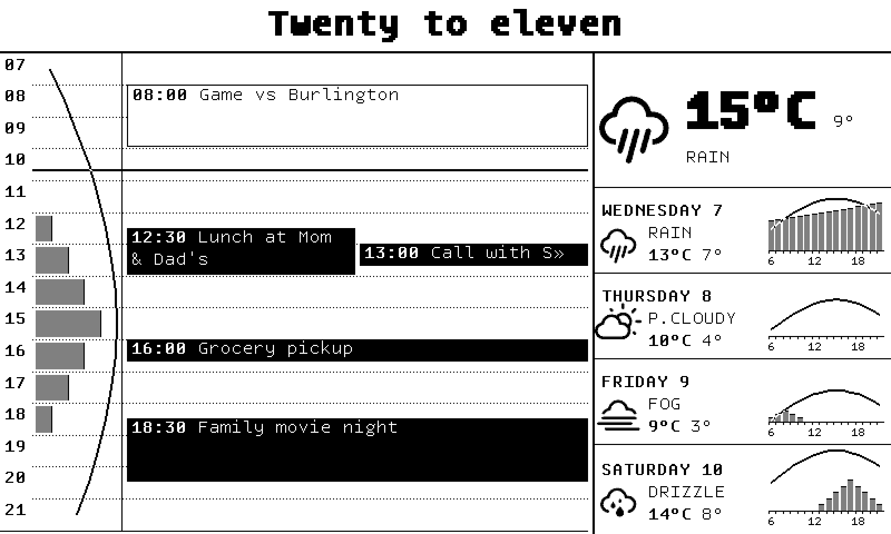

**Device view, `bw`.** The same frame. Only the rain bars change: dark gray above, solid black here. In both modes Wednesday's temperature line turns white where it crosses its bars, so it still reads over solid black.

```bash {image}

```

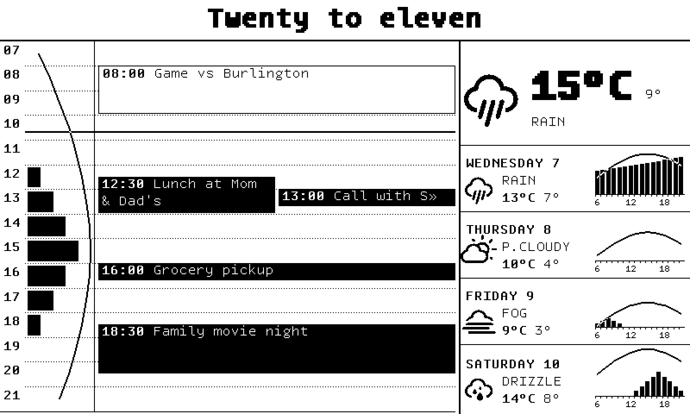

## day-timeline, behaviour by behaviour

These are the widget's golden test images, cropped to the widget (500 px wide, under a clock band). The test clock reads 13:30. The widget draws only black and white apart from the rain bars, so `bw` and `gray4` match wherever there are no bars (the Proof manifest checks this per image). The mockup's pane, for reference:


**A typical day with rain, `bw` left, `gray4` right.** Look at:

- finished events outlined, the rest solid
- the now line at 13:30 cut around the "1:1 with Sam" label, so it never reads as a strikethrough
- the half-hour Standup getting a full line of height and sharing the lane with Design review rather than overprinting it
- long titles wrapping at word boundaries ("Design / review", "Quarterly planning session / with the platform group")

```bash {image}

```

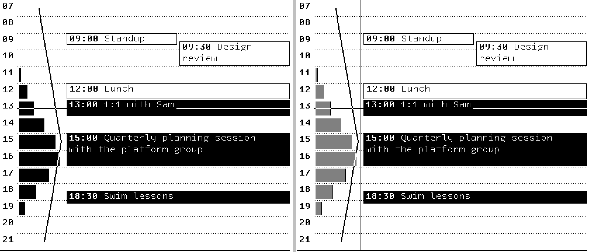

**The same day, dry.** No bars, so the lane is just the temperature line.

```bash {image}

```

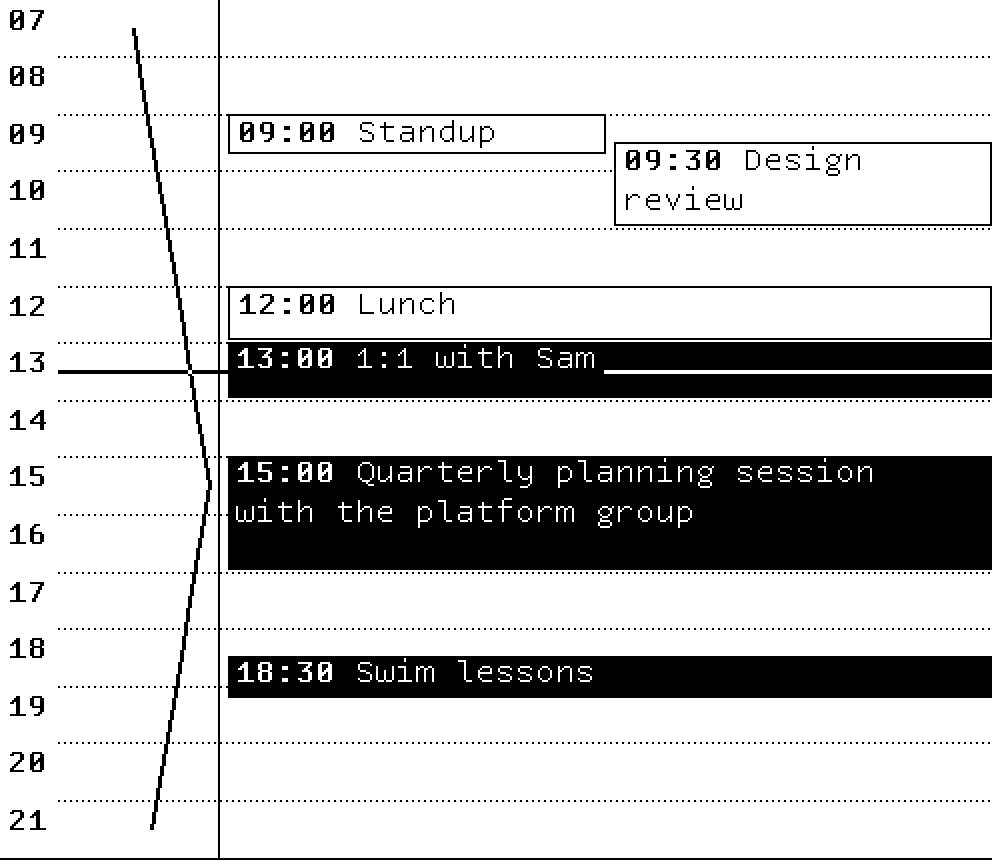

**Overlaps.** Left: two lanes at most, and the events that don't fit are counted in a "+N" tag level with the first hidden one (Standup behind the 09:00 pair, two more behind Workshop and Dentist). Right: the now line at 14:10 passing through side-by-side blocks and stopping either side of the "+1" tag.

```bash {image}

```

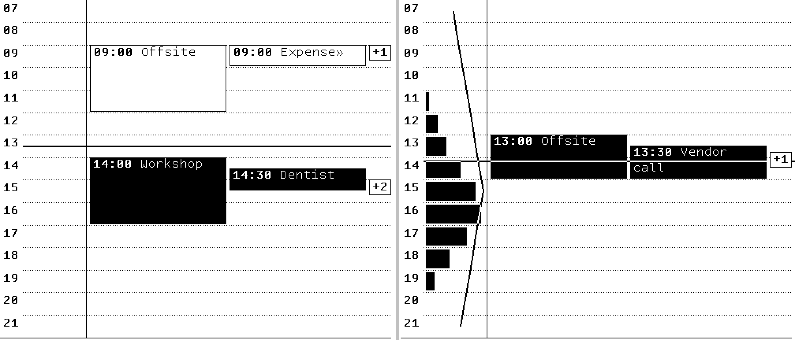

**All-day strip.** Only appears when there is something to list. Two lines at most: the first event, then "+3 MORE" (two more all-day events and a conference running through the whole of today). The 05:30 gym session is counted in "+1 EARLIER".

```bash {image}

```

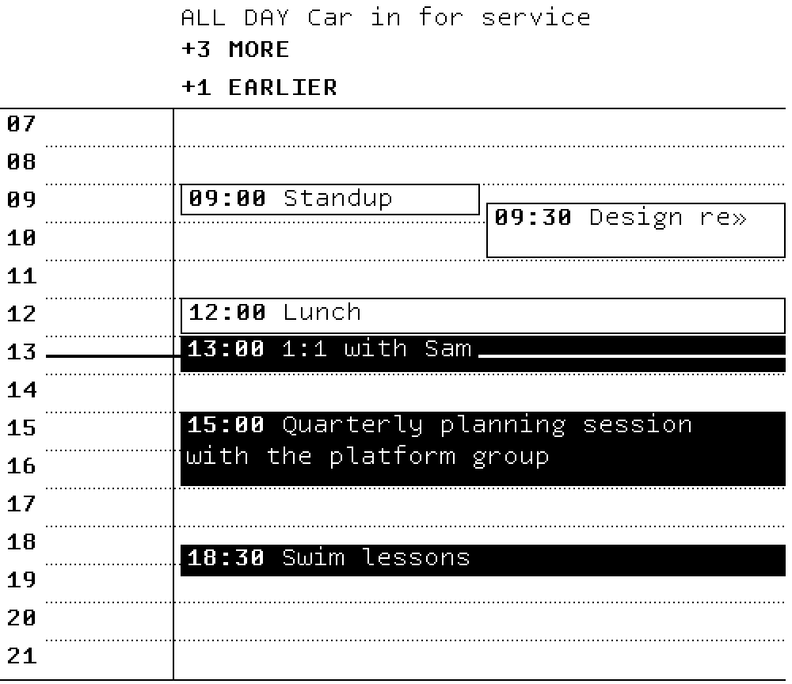

**Window edges.** Left: a red-eye flight from 05:00 and a release window running past midnight are cut at the edges, each with an arrowhead pointing the way it carries on. Right: events wholly outside the window are counted in "+2 EARLIER" and "+2 LATER" bands, which take height only when they have something to count.

```bash {image}

```

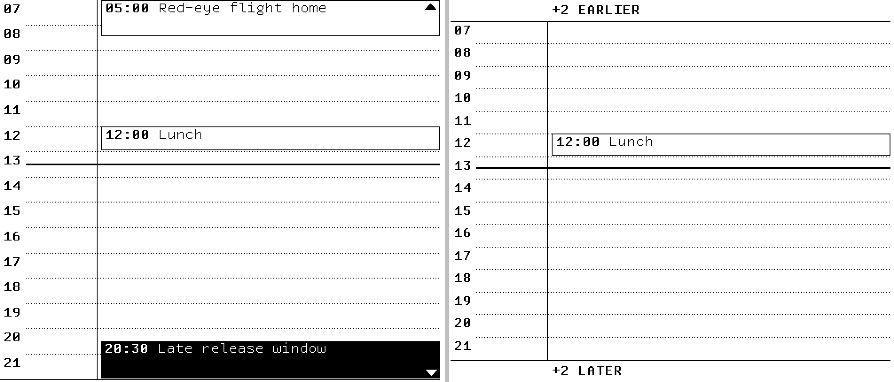

**Other windows.** Left: `start_hour: 9`, `end_hour: 17`. Rows are taller, so Standup and Design review no longer collide, and Swim lessons moves into "+1 LATER". Right: the whole day, 0 to 24, labelled every two hours.

```bash {image}

```

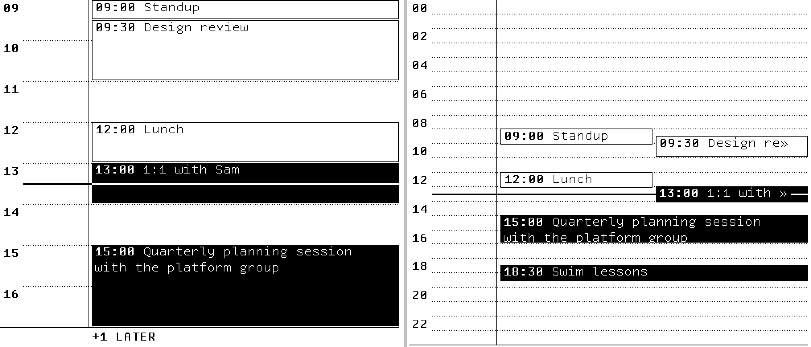

## today-weather and weather-ahead

Mockups for reference: [today-weather](https://raw.githubusercontent.com/grantlucas/inkwell/assets/115-design-reference/design/115/e-today-weather.png), [weather-ahead](https://raw.githubusercontent.com/grantlucas/inkwell/assets/115-design-reference/design/115/e-weather-ahead.png).

**today-weather: rainy, dry, negative low.** `bw` first, then `gray4`. The high is the headline at 3x, the low smaller beside it, the condition underneath. These goldens are 160 px tall; on the screen the widget gets 120.

```bash {image}

```

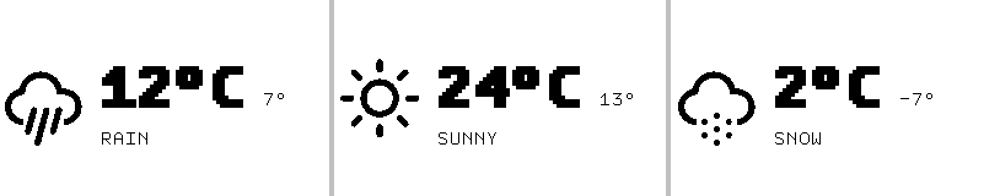

```bash {image}

```


**weather-ahead: four days of mixed weather, `bw` left, `gray4` right.** Every row's chart uses one temperature range taken across the rows, so freezing Thursday's line sits low. The line goes white where it crosses a bar.

```bash {image}

```

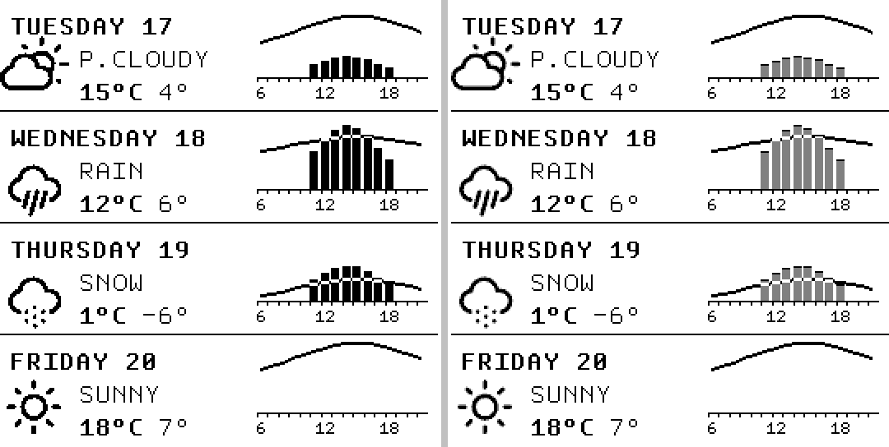

**weather-ahead with a dry day.** Wednesday has no rain, so its chart is the line alone and the row still looks full.

```bash {image}

```

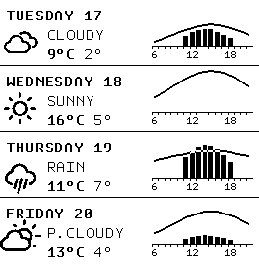

## Failure states

A widget that loses its data draws what it can, and the others are untouched. The example-config test checks that the widgets that don't read the failed source are pixel-identical to the healthy screen.

**Calendar feed down (HTTP 500).** The weather lane, the clock and the right column are unchanged. The grid is empty, and it looks exactly like a free day. That is what #170 fixes.

```bash {image}

```

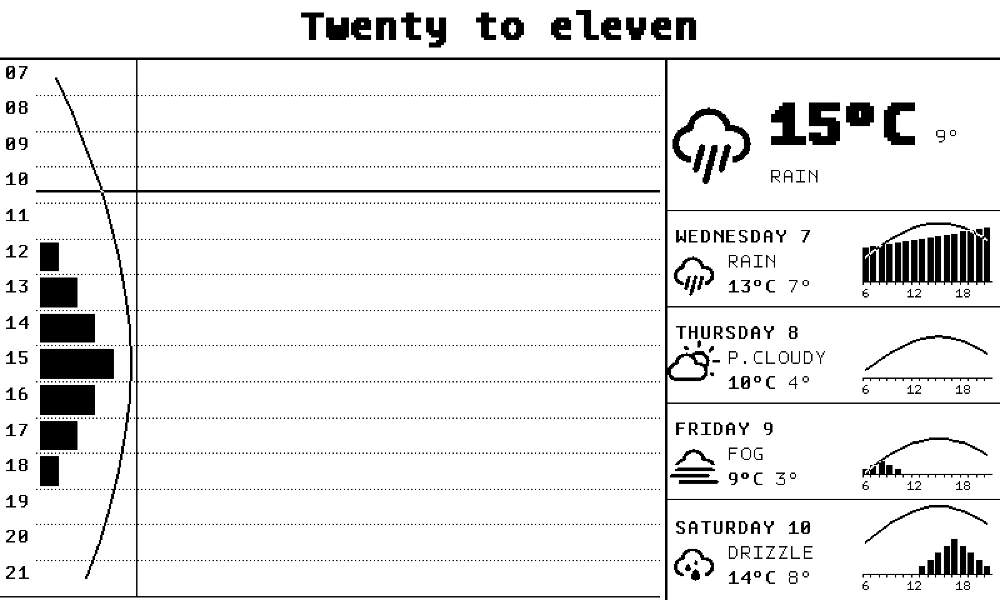

**Forecast unreachable.** today-weather and each weather-ahead row say NO FORECAST. The day-timeline keeps its events and leaves the lane blank without a note.

```bash {image}

```

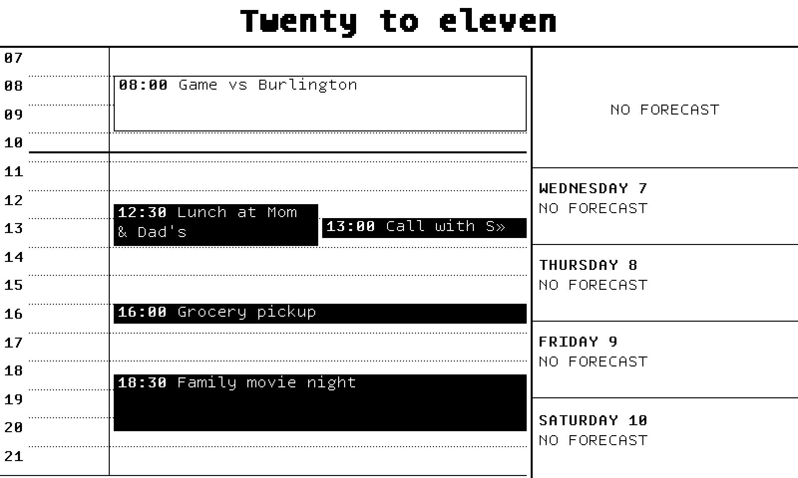

## The rest of the rotation

The example config now rotates every 15 minutes through `day-timeline`, `bold-five`, `today-hero` and `row-agenda`. weekly-calendar is still registered but no longer in the example. These are drawn from the example config with a few events added on the following days (the example's own feed only has today), `bw` device view.

**bold-five.** The clock band on top, three events a column then "+N MORE", a combined chart in every column on one shared range.

```bash {image}

```

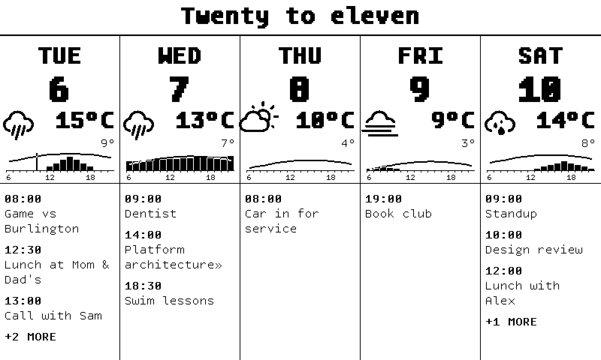

**today-hero.** Today's date as plain text over a rule (no filled block), only what is left of today in the agenda, and a small combined chart in each day row.

```bash {image}

```

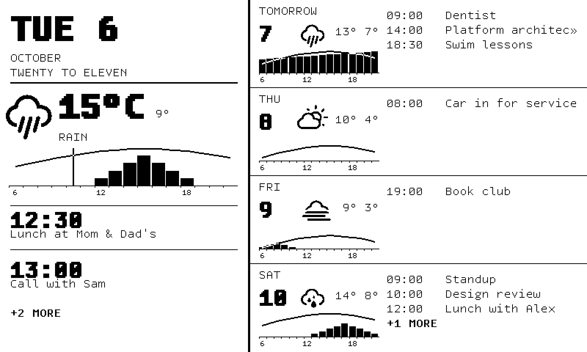

**row-agenda.** One event column per row with room for "Platform architecture review", rows sized to their events, and a chart in every row.

```bash {image}

```

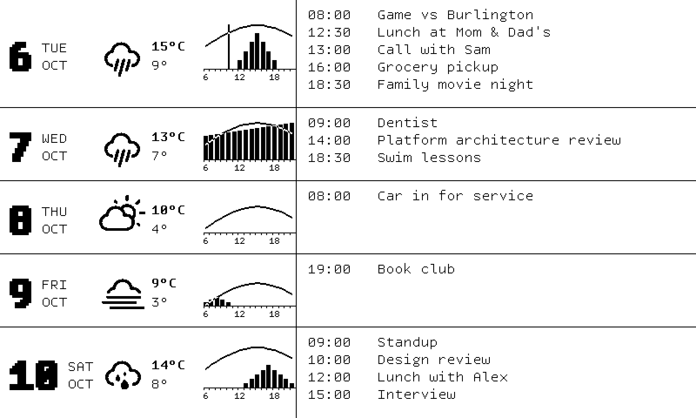

## Placeable widgets (#128)

bold-five, today-hero and row-agenda used to draw the day badge, the hourly chart and the event list inside themselves. Those are now the `day-badge`, `combined-chart` and `event-list` widgets, and the full-screen widgets draw through the same code, with no existing golden changed (checked in [Proof](#proof)). The example config ends with a commented-out `today-and-tomorrow` screen built from them. This is it uncommented, `bw` device view:

```bash {image}

```

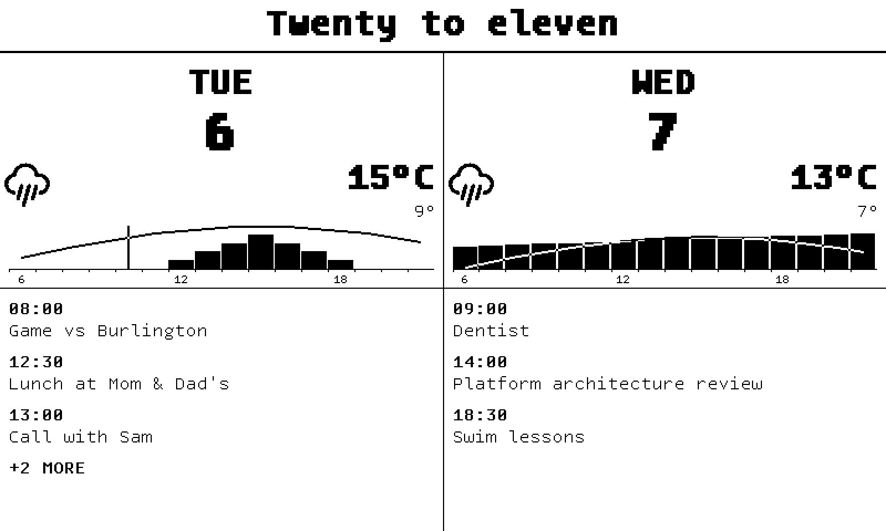

**How separately placed charts share one temperature range (ADR 0015).** Each `combined-chart` takes `day` and `range_days` (default 5). Every render asks the day data module for `range_days` days from today and plots its own day on the range that comes back, so charts with the same `range_days` on the same forecast agree without knowing about each other or adding anything to the compositor. The rule for screen authors: give every chart on a screen the same `range_days`. Its limits are that the span always starts at today, and that a forecast cache refresh landing between two charts' renders could give them different ranges for one cycle.

## Proof

The whole suite passes with full statement coverage:

```bash
cov=$(mktemp)
go test -count=1 -coverprofile="$cov" ./internal/... 2>&1 | awk '$1=="ok"{ok++} $1=="FAIL"{fail++} END{print ok+0, "packages pass,", fail+0, "fail"}'
go tool cover -func="$cov" | grep '^total:' | tr -s '\t ' ' '
rm -f "$cov"
```

```output
30 packages pass, 0 fail
total: (statements) 100.0%
```

The example-config tests load `inkwell.example.yaml` through the real loader and registry: the composed screen's golden, one rule under the clock, the right column lined up, each source going down without blanking the others, the rotation, and the uncommented today-and-tomorrow screen:

```bash
go test -count=1 -v -run '^TestExampleConfig' ./internal/inkwell/ | grep -E '^ *--- ' | sed 's/ (.*//'
```

```output
--- PASS: TestExampleConfig_ComposedScreen
--- PASS: TestExampleConfig_DayTimelineScreen
--- PASS: TestExampleConfig_DayTimelineScreen_OneRuleUnderTheClock
--- PASS: TestExampleConfig_DayTimelineScreen_RightColumnLinesUp
--- PASS: TestExampleConfig_Rotation
    --- PASS: TestExampleConfig_Rotation/day-timeline
    --- PASS: TestExampleConfig_Rotation/bold-five
    --- PASS: TestExampleConfig_Rotation/today-hero
    --- PASS: TestExampleConfig_Rotation/row-agenda
--- PASS: TestExampleConfig_DayTimelineScreen_SourceDown
    --- PASS: TestExampleConfig_DayTimelineScreen_SourceDown/calendar_feed_down
    --- PASS: TestExampleConfig_DayTimelineScreen_SourceDown/forecast_unreachable
```

The #128 extraction was a pure refactor: no golden image changed. Comparing the integration branch before and after its merge (`460607c` to `616d8f0`), no PNG was modified or deleted, and the 14 added are the new widgets' goldens:

```bash
echo "modified or deleted: $(git diff --name-only --diff-filter=MD 460607c 616d8f0 -- '*.png' | wc -l | tr -d ' ')"
echo "added: $(git diff --name-only --diff-filter=A 460607c 616d8f0 -- '*.png' | wc -l | tr -d ' ')"
git diff --name-only --diff-filter=A 460607c 616d8f0 -- '*.png'
```

```output
modified or deleted: 0
added: 14
internal/inkwell/testdata/TestExampleConfig_ComposedScreen.png
internal/inkwell/widgets/combinedchart/testdata/TestWidget_Golden_a_dry_day_in_a_row-agenda_badge.png
internal/inkwell/widgets/combinedchart/testdata/TestWidget_Golden_the_coldest_day_in_today-hero's_hero.png
internal/inkwell/widgets/combinedchart/testdata/TestWidget_Golden_today_in_a_bold-five_column.png
internal/inkwell/widgets/daybadge/testdata/TestWidget_Golden_column_today.png
internal/inkwell/widgets/daybadge/testdata/TestWidget_Golden_column_with_no_forecast.png
internal/inkwell/widgets/daybadge/testdata/TestWidget_Golden_compact_in_fahrenheit.png
internal/inkwell/widgets/daybadge/testdata/TestWidget_Golden_compact_tomorrow.png
internal/inkwell/widgets/daybadge/testdata/TestWidget_Golden_hero_today.png
internal/inkwell/widgets/daybadge/testdata/TestWidget_Golden_row_tomorrow.png
internal/inkwell/widgets/eventlist/testdata/TestWidget_Golden_inline_for_tomorrow.png
internal/inkwell/widgets/eventlist/testdata/TestWidget_Golden_large_for_what_is_left_of_today.png
internal/inkwell/widgets/eventlist/testdata/TestWidget_Golden_stacked_in_a_bold-five_column.png
internal/inkwell/widgets/eventlist/testdata/TestWidget_Golden_stacked_on_an_empty_day.png
```

The images in this demo are rebuilt by this block. It writes a throwaway test into `internal/inkwell`, renders the example screens and packs the widget goldens through the device path, then deletes the test. Each line gives the image's size, a hash of its pixels, and whether `bw` and `gray4` differ for that picture. The last line checks every image against the ones committed beside this file.

```bash
out=$(mktemp -d)
gen=internal/inkwell/zz_demo115_test.go
trap 'rm -rf "$gen" "$out"' EXIT
cat > "$gen" <<'GO'
package inkwell

// Throwaway generator for docs/demos/day-timeline-screen.md. Not committed.

import (
	"crypto/sha256"
	"errors"
	"fmt"
	"image"
	"image/color"
	"image/draw"
	"image/png"
	"net/http"
	"os"
	"path/filepath"
	"slices"
	"strings"
	"testing"
	"time"

	"github.com/grantlucas/inkwell/internal/inkwell/testutil/fakehttp"
	"github.com/grantlucas/inkwell/internal/inkwell/widget"
)

const demoDocImages = "../../docs/demos/day-timeline-screen"

// demoWeek is the example's day plus a few events on the days after it.
func demoWeek() string {
	day := exampleDay()
	var b strings.Builder
	event := func(uid, summary string, dayN, h, m, mins int) {
		start := exampleToday.AddDate(0, 0, dayN).Add(time.Duration(h)*time.Hour + time.Duration(m)*time.Minute).UTC()
		end := start.Add(time.Duration(mins) * time.Minute)
		fmt.Fprintf(&b, "BEGIN:VEVENT\r\nUID:%s\r\nSUMMARY:%s\r\nDTSTART:%s\r\nDTEND:%s\r\nEND:VEVENT\r\n",
			uid, summary, start.Format("20060102T150405Z"), end.Format("20060102T150405Z"))
	}
	event("w1", "Dentist", 1, 9, 0, 60)
	event("w2", "Platform architecture review", 1, 14, 0, 90)
	event("w3", "Swim lessons", 1, 18, 30, 45)
	event("w4", "Car in for service", 2, 8, 0, 120)
	event("w5", "Book club", 3, 19, 0, 120)
	event("w6", "Standup", 4, 9, 0, 15)
	event("w7", "Design review", 4, 10, 0, 60)
	event("w8", "Lunch with Alex", 4, 12, 0, 60)
	event("w9", "Interview", 4, 15, 0, 60)
	return strings.Replace(day, "END:VCALENDAR", b.String()+"END:VCALENDAR", 1)
}

func demoScreen(t *testing.T, name string, client *fakehttp.Client) image.Image {
	t.Helper()
	_, frame := renderExampleScreen(t, name, client)
	return frame
}

func demoComposed(t *testing.T) image.Image {
	t.Helper()
	raw, err := os.ReadFile(exampleConfigPath)
	if err != nil {
		t.Fatal(err)
	}
	cfg, err := LoadConfig(strings.NewReader(uncommentScreen(t, string(raw), composedScreen)))
	if err != nil {
		t.Fatal(err)
	}
	client := exampleUpstream()
	client.Serve(exampleFeed, demoWeek())
	app, err := NewApp(cfg, WithHardware(&MockHardware{}), WithHTTPClient(client), WithDeps(widget.Deps{Now: exampleNow}))
	if err != nil {
		t.Fatal(err)
	}
	s := app.dashboard.screens[len(app.dashboard.screens)-1]
	frame, err := app.comp.Render(s.Widgets())
	if err != nil {
		t.Fatal(err)
	}
	return frame
}

// demoGolden loads a golden PNG and places it on a blank panel at its origin.
func demoGolden(t *testing.T, path string) image.Image {
	t.Helper()
	f, err := os.Open(path)
	if err != nil {
		t.Fatal(err)
	}
	defer func() { _ = f.Close() }()
	img, err := png.Decode(f)
	if err != nil {
		t.Fatal(err)
	}
	panel := image.NewRGBA(image.Rect(0, 0, 800, 480))
	draw.Draw(panel, panel.Bounds(), image.White, image.Point{}, draw.Src)
	draw.Draw(panel, img.Bounds(), img, img.Bounds().Min, draw.Src)
	return panel
}

// demoDevice packs src the way the device path does and unpacks it again.
func demoDevice(t *testing.T, src image.Image, mode string) *image.Paletted {
	t.Helper()
	p, err := applyColorMode(&Waveshare7in5V2, mode)
	if err != nil {
		t.Fatal(err)
	}
	buf, err := PackImage(p, src)
	if err != nil {
		t.Fatal(err)
	}
	return UnpackBuffer(p, buf)
}

var demoPalette = color.Palette{color.Gray{Y: 0xFF}, color.Gray{Y: 0xC0}, color.Gray{Y: 0x80}, color.Gray{Y: 0x00}}

// demoStack lays crops side by side at 2x, with a light gray gap.
func demoStack(parts ...image.Image) *image.Paletted {
	const scale, gap = 2, 16
	w, h := -gap, 0
	for _, p := range parts {
		w += p.Bounds().Dx()*scale + gap
		h = max(h, p.Bounds().Dy()*scale)
	}
	dst := image.NewPaletted(image.Rect(0, 0, w, h), demoPalette)
	x0 := 0
	for i, p := range parts {
		b := p.Bounds()
		for y := 0; y < b.Dy()*scale; y++ {
			for x := 0; x < b.Dx()*scale; x++ {
				dst.Set(x0+x, y, p.At(b.Min.X+x/scale, b.Min.Y+y/scale))
			}
		}
		x0 += b.Dx()*scale + gap
		if i < len(parts)-1 {
			for y := range h {
				for x := x0 - gap + 4; x < x0-4; x++ {
					dst.SetColorIndex(x, y, 1)
				}
			}
		}
	}
	return dst
}

func demoHash(img image.Image) string {
	h := sha256.New()
	b := img.Bounds()
	fmt.Fprintf(h, "%dx%d", b.Dx(), b.Dy())
	for y := b.Min.Y; y < b.Max.Y; y++ {
		for x := b.Min.X; x < b.Max.X; x++ {
			h.Write([]byte{color.GrayModel.Convert(img.At(x, y)).(color.Gray).Y})
		}
	}
	return fmt.Sprintf("%x", h.Sum(nil))[:12]
}

type demoCrop struct {
	r    image.Rectangle
	mode string
}

func TestDemo115(t *testing.T) {
	out := os.Getenv("DEMO_OUT")
	if out == "" {
		t.Skip("set DEMO_OUT")
	}
	if err := os.MkdirAll(out, 0o755); err != nil {
		t.Fatal(err)
	}

	panel := image.Rect(0, 0, 800, 480)
	timeline := image.Rect(0, 48, 500, 480)
	dt := "widgets/daytimeline/testdata/TestWidget_Golden_"
	tw := "widgets/todayweather/testdata/TestWidget_Golden_"
	wa := "widgets/weatherahead/testdata/TestWidget_Golden_"

	week := func() *fakehttp.Client {
		c := exampleUpstream()
		c.Serve(exampleFeed, demoWeek())
		return c
	}
	down := func(url string, r fakehttp.Reply) *fakehttp.Client {
		c := exampleUpstream()
		c.Set(url, r)
		return c
	}
	g := func(path string) func() []image.Image {
		return func() []image.Image { return []image.Image{demoGolden(t, path)} }
	}
	gs := func(paths ...string) func() []image.Image {
		return func() []image.Image {
			var imgs []image.Image
			for _, p := range paths {
				imgs = append(imgs, demoGolden(t, p))
			}
			return imgs
		}
	}
	screen := func(name string, c func() *fakehttp.Client) func() []image.Image {
		return func() []image.Image { return []image.Image{demoScreen(t, name, c())} }
	}

	shots := []struct {
		name  string
		src   func() []image.Image
		crops []demoCrop
	}{
		{"screen-gray4", screen("day-timeline", exampleUpstream), []demoCrop{{panel, "gray4"}}},
		{"screen-bw", screen("day-timeline", exampleUpstream), []demoCrop{{panel, "bw"}}},
		{"dt-rainy", g(dt + "rainy_day.png"), []demoCrop{{timeline, "bw"}, {timeline, "gray4"}}},
		{"dt-dry", g(dt + "dry_day.png"), []demoCrop{{timeline, "bw"}}},
		{"dt-overlap", gs(dt+"three_simultaneous_events.png", dt+"now_through_side-by-side_blocks_and_a_tag.png"), []demoCrop{{timeline, "bw"}}},
		{"dt-allday", g(dt + "more_than_two_all-day_events.png"), []demoCrop{{timeline, "bw"}}},
		{"dt-edges", gs(dt+"clipped_at_each_edge.png", dt+"outside_the_window_on_both_sides.png"), []demoCrop{{timeline, "bw"}}},
		{"dt-window", gs(dt+"working_hours_window.png", dt+"whole_day_window.png"), []demoCrop{{timeline, "bw"}}},
		{"tw-three-bw", gs(tw+"rainy_day.png", tw+"dry_day.png", tw+"negative_low.png"), []demoCrop{{image.Rect(0, 0, 266, 160), "bw"}}},
		{"tw-three-gray4", gs(tw+"rainy_day.png", tw+"dry_day.png", tw+"negative_low.png"), []demoCrop{{image.Rect(0, 0, 266, 160), "gray4"}}},
		{"wa-mixed", g(wa + "four_days_in_mixed_weather.png"), []demoCrop{{image.Rect(0, 0, 266, 272), "bw"}, {image.Rect(0, 0, 266, 272), "gray4"}}},
		{"wa-dry", g(wa + "a_dry_day.png"), []demoCrop{{image.Rect(0, 0, 266, 272), "bw"}}},
		{"down-calendar", screen("day-timeline", func() *fakehttp.Client {
			return down(exampleFeed, fakehttp.Reply{Status: http.StatusInternalServerError})
		}), []demoCrop{{panel, "bw"}}},
		{"down-forecast", screen("day-timeline", func() *fakehttp.Client {
			return down(exampleForecast, fakehttp.Reply{Err: errors.New("network is unreachable")})
		}), []demoCrop{{panel, "bw"}}},
		{"rot-bold-five", screen("bold-five", week), []demoCrop{{panel, "bw"}}},
		{"rot-today-hero", screen("today-hero", week), []demoCrop{{panel, "bw"}}},
		{"rot-row-agenda", screen("row-agenda", week), []demoCrop{{panel, "bw"}}},
		{"composed-today-and-tomorrow", func() []image.Image { return []image.Image{demoComposed(t)} }, []demoCrop{{panel, "bw"}}},
	}

	committed := map[string]bool{}
	files, _ := filepath.Glob(filepath.Join(demoDocImages, "*.png"))
	for _, f := range files {
		r, err := os.Open(f)
		if err != nil {
			t.Fatal(err)
		}
		img, err := png.Decode(r)
		_ = r.Close()
		if err != nil {
			t.Fatal(err)
		}
		committed[demoHash(img)] = true
	}

	var lines []string
	matched := 0
	for _, s := range shots {
		var parts []image.Image
		same := true
		for _, src := range s.src() {
			for _, c := range s.crops {
				dev := demoDevice(t, src, c.mode)
				other := demoDevice(t, src, map[string]string{"bw": "gray4", "gray4": "bw"}[c.mode])
				if demoHash(dev.SubImage(c.r)) != demoHash(other.SubImage(c.r)) {
					same = false
				}
				parts = append(parts, dev.SubImage(c.r))
			}
		}
		img := demoStack(parts...)
		f, err := os.Create(filepath.Join(out, s.name+".png"))
		if err != nil {
			t.Fatal(err)
		}
		if err := png.Encode(f, img); err != nil {
			t.Fatal(err)
		}
		_ = f.Close()
		h := demoHash(img)
		if committed[h] {
			matched++
		}
		modes := "bw and gray4 differ"
		if same {
			modes = "bw == gray4"
		}
		lines = append(lines, fmt.Sprintf("%-32s %4dx%-4d %s  %s", s.name+".png", img.Bounds().Dx(), img.Bounds().Dy(), h, modes))
	}
	slices.Sort(lines)
	lines = append(lines, fmt.Sprintf("%d images made; %d match a committed demo image pixel for pixel", len(shots), matched))
	if err := os.WriteFile(filepath.Join(out, "manifest.txt"), []byte(strings.Join(lines, "\n")+"\n"), 0o644); err != nil {
		t.Fatal(err)
	}
}
GO
DEMO_OUT="$out" go test -count=1 -run '^TestDemo115$' ./internal/inkwell/ >/dev/null && cat "$out/manifest.txt"

```

```output
composed-today-and-tomorrow.png  1600x960  89225e933ac4  bw and gray4 differ
down-calendar.png                1600x960  3474ed969460  bw and gray4 differ
down-forecast.png                1600x960  6383392957da  bw == gray4
dt-allday.png                    1000x864  c6edf5e73eae  bw == gray4
dt-dry.png                       1000x864  896e5c40fa9e  bw == gray4
dt-edges.png                     2016x864  aa83fa2872f4  bw == gray4
dt-overlap.png                   2016x864  81e96a472c4f  bw and gray4 differ
dt-rainy.png                     2016x864  2a776133894e  bw and gray4 differ
dt-window.png                    2016x864  f37a15576c50  bw == gray4
rot-bold-five.png                1600x960  1a46b5f852b9  bw and gray4 differ
rot-row-agenda.png               1600x960  a6a37d9dcb12  bw and gray4 differ
rot-today-hero.png               1600x960  c9b7f792106a  bw and gray4 differ
screen-bw.png                    1600x960  4c1f5569feb8  bw and gray4 differ
screen-gray4.png                 1600x960  2d3d881c1db9  bw and gray4 differ
tw-three-bw.png                  1628x320  470b4cde52aa  bw and gray4 differ
tw-three-gray4.png               1628x320  681b506cf4ff  bw and gray4 differ
wa-dry.png                        532x544  1cf397b34268  bw and gray4 differ
wa-mixed.png                     1080x544  cfa58e5a8ebe  bw and gray4 differ
18 images made; 18 match a committed demo image pixel for pixel
```

## Decisions for you

Answer inline, by number. The first six came out of the code review; the rest are calls made while building or things I noticed making this demo.

1. **Type sizes.** day-timeline block times and weather-ahead's weekday and high are 1x bold, not the spec's 2x, because 2x doesn't fit ("WEDNESDAY 30" at 2x is about 236 px of a 266 px column). OK?
2. **Clock scale.** `fuzzy_clock` sits at scale 2 in the header band; at scale 3 the longest phrase doesn't fit 800 px, and the spec says the scale is fixed rather than shrinking for long phrases. OK?
3. **#128's two behaviour changes.** An empty-day note ("--", "DONE FOR TODAY") is now cut to the list's width, and is drawn only when a whole line fits. Before, it could run over a divider or past the widget's bottom. No golden catches either. Accept?
4. **A widget render error still drops the whole frame.** Widgets avoid it by contract: they draw "NO FORECAST" and the like, and never return an error. Ticket a compositor change so one bad widget can't blank the screen?
5. **README still describes Bayer dithering** and a black-and-white-only panel (around lines 20 to 26). Ticket it?
6. **Rotation cadence.** The example rotates through four screens every 15 minutes, so all four show within an hour; on `bw` that is a flash per rotation. Right cadence for the example?
7. **Weather lane width** is 80 px. That makes the day-timeline's minimum width 238 px and leaves the events column narrower (the "Call with S»" cut above). OK?
8. **Now marker behind text.** It is cut around block labels and "+N" tags (a line through a label read as a strikethrough), and kept a row clear of the hour rules, so it can be up to about 2 minutes off near the hour. OK?
9. **Short events share a lane.** A half-hour event gets a whole line of height and, if that runs into the next event, the two sit side by side (Standup and Design review above) rather than the short one being squeezed back to half a line. OK?
10. **Large numerals fill in.** On bold-five, row-agenda and today-hero, the big "8" (THU 8) reads as a near-solid block with two pinholes, and the "0" in "10" nearly closes up. The numeral dilation is already on `main` and predates this branch, but these are the screens #115 puts in the rotation. Ticket it?
11. **Clipped second line.** In the whole-day window (0 to 24), "with the platform group" is drawn on a block not quite tall enough for it, so its descenders are cut at the block's bottom edge. Acceptable, or should a line only draw when it fits whole?
12. **Stub beside the "+N" tag.** Where the now line meets a tag at the right edge, a couple of pixels of line show between the tag and the widget's edge (the overlap image, at 14:10). Leave it, or stop the line at the tag?
13. **Forecast down leaves the lane blank** with no note, while the right column says NO FORECAST. Fine as is, or fold a lane note into #170?
14. **bold-five shows finished events.** At 10:40 today's column still lists the 08:00 game and pushes two upcoming events into "+2 MORE", while today-hero shows only what is left. Keep it, or hide finished events on bold-five too?
15. **Sentence-case clock.** The clock reads "Twenty to eleven"; the mockup has it in capitals. Keep sentence case?
