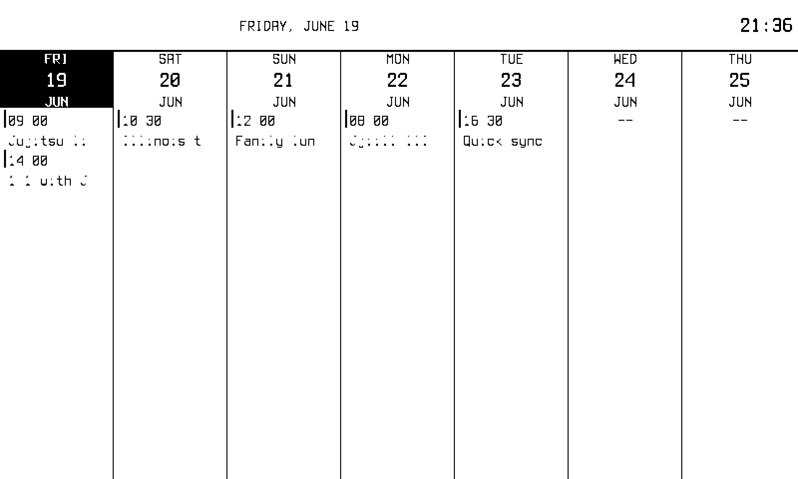
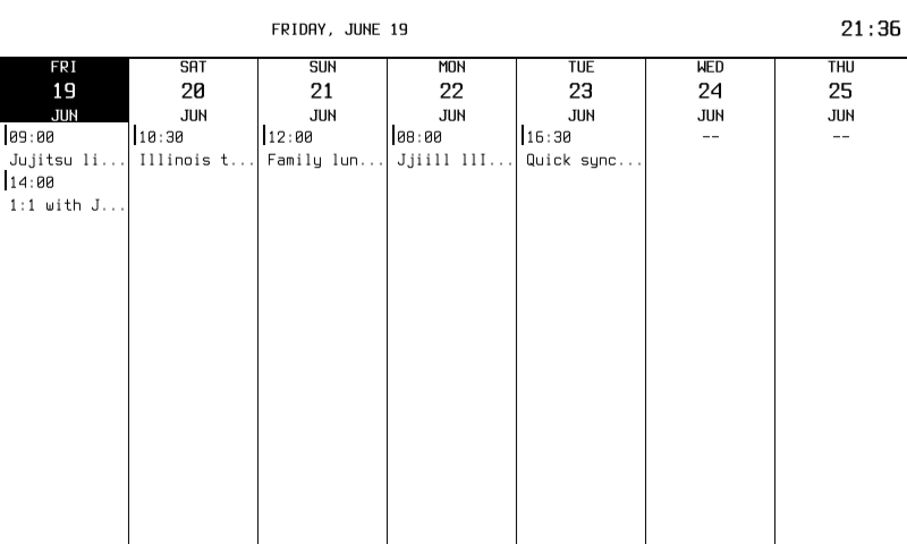
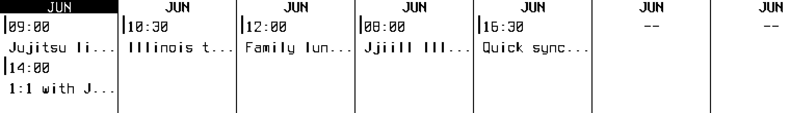
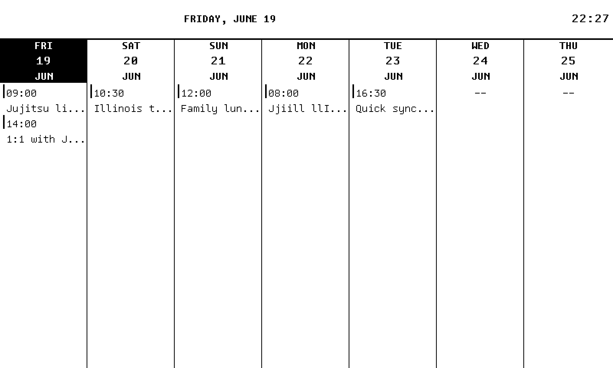

# inkwell-5yh — BW text legibility fix

*2026-06-20T01:47:08Z by Showboat 0.6.1*
<!-- showboat-id: 19c396c5-d405-4045-aa52-8d96aaf71663 -->

## The problem

`inkwell-5yh`: in `bw` `color_mode` (1-bit, the `packBW` threshold in
`internal/inkwell/buffer.go`), rendered text reads too thin and faint on
the Waveshare panel. Thin anti-aliased glyph stems disconnect entirely —
the colon in clock times, the `1`/`i`/`l`/`j` stems, and Terminus Regular
body text in the weekly calendar. Gray4 hides this because its light/dark
buckets preserve partial coverage; the strict BW threshold does not.

## Reproduction

I drove the real web preview with `rodney` against a sample dashboard
(date + clock + a weekly-calendar fed by a local ICS with deliberately
stem-heavy event titles: "Jujitsu", "Illinois", "1:1 with Jill", times
like 09:00 / 10:30). The default view at `http://localhost:8080/frame.png`
is the **post-pack device buffer** — exactly what the panel shows.

Below: the BW **device view** (what the panel renders) before the fix.

```bash {image}

```



Times collapse (`09:00` → `09 00`, the colon gone), titles shred
(`Jujitsu` → `Ju;:tsu`, `Illinois` → `:::no:s`). The **same frame** in the
`?source=1` design-intent view (the 12-level grayscale source the
compositor draws, before packing) is perfectly legible — proving the loss
happens entirely at the `packBW` threshold:

```bash {image}

```



## Root cause

The compositor draws text with `font.Drawer`, alpha-blending black over a
white background into a 12-level `PaperPalette` image, then `packBW`
thresholds it at `Y < 128`.

A 1px-wide anti-aliased stem that straddles two columns deposits ~50% ink
in each. Blended over white that is `Y ≈ 128`, which the palette quantises
to `PaperGray50` (Y = 0x80 = 128). The strict `Y < 128` test then evaluates
`128 < 128` → false → **white**, so the stem's own centre column drops out.
That is precisely why thin features disconnect: the most-covered part of a
thin stroke is the part being discarded.

## Exploring the fix (offline, against the real source frame)

I thresholded the actual `?source=1` frame at several cutoffs (this
replicates `packBW` exactly, since both read the same `color.GrayModel`
luminance). Dilation/emboldening on the already-quantised frame only added
noise. Raising the cutoff so half-covered pixels survive recovered every
glyph. Left: baseline `Y < 128`. Right: `Y <= 128` (the chosen fix).

```bash {image}

```


```bash {image}

```



## The fix

One boundary change in `packBW`: ink any pixel that is **at least half
covered** rather than strictly more than half.

```go
if g.Y <= 128 { // at least half covered → black → bit = 1
```

This carries weight via the glyph's own anti-aliased coverage (no gray
fills, no dithering — both forbidden by the project's rendering rules) and
flips only one palette bucket: `PaperGray50` (Y=128) now lands black. Gray4
is untouched — it has its own bucket mapping in `packGray4`. The pinned
threshold tests (`TestPackBW_ThresholdAtBoundary`, `TestPaperPalette_BWBucket`)
were updated to record the new, intentional boundary.

## Verification — tests

```bash
go test ./internal/inkwell/ ./internal/inkwell/widget/ -run 'PackBW|PackImage|PaperPalette|UnpackBuffer|ReconstructFrame' -count=1 >/dev/null 2>&1 && echo "packBW + palette boundary tests: PASS"
```

```output
packBW + palette boundary tests: PASS
```

## Result — BW device view AFTER the fix

Captured the same sample dashboard through `rodney` again. The BW **device
view** now matches the design intent — `09:00`, `Jujitsu li…`, `Illinois
t…`, `Family lun…`, `1:1 with J…` are all legible, and the bold headers
are unchanged (no over-thickening):

```bash {image}

```


## No Gray4 regression

The same dashboard in `color_mode: gray4` is unchanged — only `packBW`
moved, so the Gray4 path is identical to before:

```bash {image}

```


## Summary

- **Change:** `packBW` threshold `Y < 128` → `Y <= 128` (ink pixels ≥ 50%
  covered).
- **Why it works:** recovers the ~50%-covered stem centres that quantise
  to `PaperGray50` (Y=128) and were being dropped.
- **Scope:** BW path only; Gray4 unaffected by construction.
- **Tests:** `packBW` at 100% statement coverage; pinned boundary tests
  updated to the new intentional cutoff; full suite green.
- **Docs:** `AGENTS.md` rendering rules updated to the `Y <= 128` boundary.

---

# Part 2 — the root-cause fix: a bitmap font (inkwell-qd8)

The `Y <= 128` threshold above is a real improvement, but it treats a
symptom. The deeper cause: Inkwell rendered **TerminusTTF — an outline
font — through `x/image/opentype`, which always anti-aliases** (and
ignores the TTF's own embedded bitmap strikes). Every small glyph arrives
with a gray AA fringe that the 1-bit panel must threshold, so thin stems
stay fragile.

A survey of e-ink dashboards (TRMNL, InkyPi, MagInk*, Inkplate/GxEPD2) and
the Go font ecosystem points to one root-cause fix: render a **true bitmap
font** with no anti-aliasing. Bitmap glyphs are pure black/white masks —
there is no fringe to lose.

## What changed

- New in-house BDF parser (`internal/inkwell/fonts/bdf.go`) → a
  `golang.org/x/image/font.Face` backed by pure 1-bit glyph masks.
- `fonts.Face(weight, sizePt)` now renders **Tamzen** (Regular + Bold,
  embedded at 12/16/20px), snapping the point size to the nearest pixel
  tier. The public API is unchanged, so no widget needed editing.
- Chosen by a device-view bake-off (Tamzen vs Spleen vs Cozette);
  Tamzen won because it ships a real Bold, preserving the same-size
  weight contrast widgets rely on (day-headers vs events).

## Result — BW device view, bitmap font

Every event title, time, and bold header is crisp with zero
fragmentation, and it no longer depends on the threshold band-aid:

```bash {image}

```



Gray4 is also clean (text is now solid black rather than AA-gray), and the BDF parser is covered to 100%. The bitmap path makes `fonts.Regular` safe at every shipped size.
