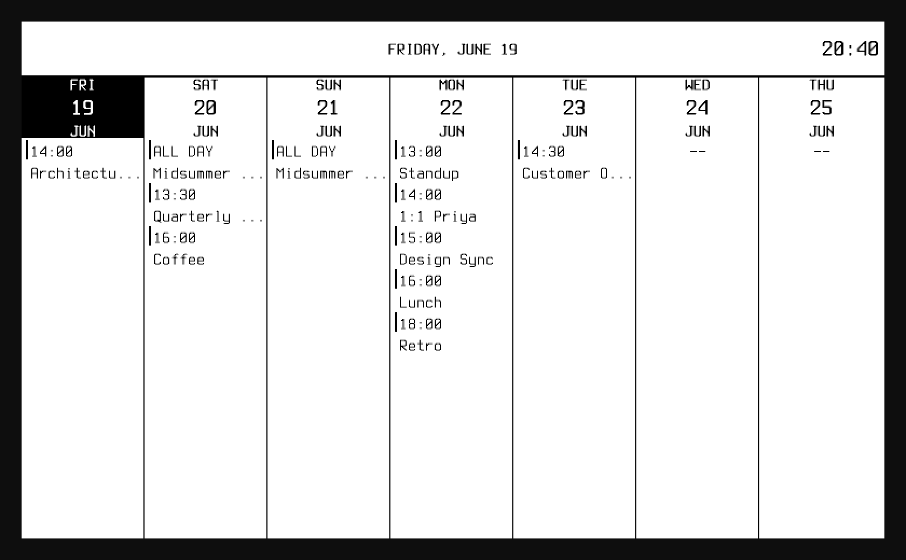
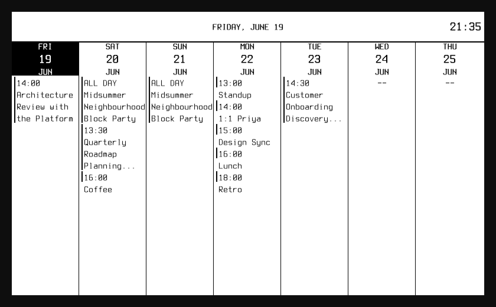
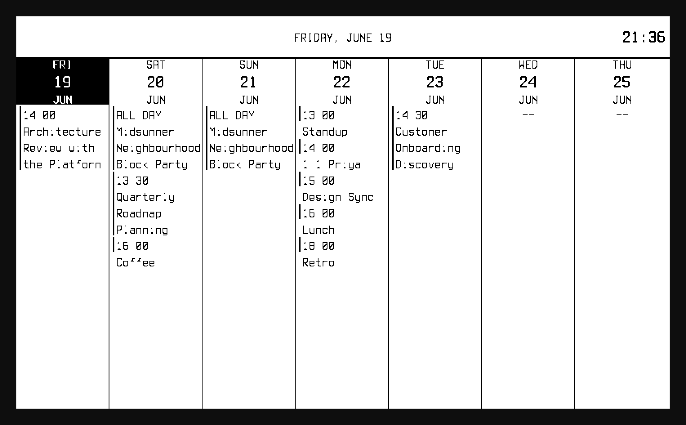

<!-- markdownlint-disable MD013 MD040 MD036 -->

# inkwell-ehc — Wrapping weekly event titles into leftover column space

*2026-06-20T00:42:15Z by Showboat 0.6.1*
<!-- showboat-id: 5eb10f6e-0da8-49de-81cf-3e0111181cc2 -->

**Issue:** `inkwell-ehc` — *feat(weekly): wrap event titles to use leftover vertical space when day has few events.*

**Problem.** The weekly widget gives every day column the same fixed height but caps events at `MaxEvents` (default 5). Each event drew as exactly two lines — a time line and a title hard-truncated to the column width by `truncateText`. On a day with only one or two events most of the column was empty white space, yet the few titles present were still cut to `...`: the worst of both worlds.

**Change.** `renderEvents` (`internal/inkwell/widgets/weekly/events.go`) became *plan-then-draw*. `planEvents` lays events out at their baseline cost — exactly mirroring the old slot accounting, so a packed column is byte-for-byte unchanged — then hands any leftover line slots to titles that overflow the column width. `wrapText` breaks those titles on word boundaries (hard-breaking a word wider than the column), capped at 3 lines per title and distributed per-column. Short titles and full columns still take the original single-line `truncateText` path, so there is no regression.

Run the unit tests that drive the feature — title wrapping (`wrapText`), the per-column line budget (`planEvents`, `lineCapacity`) and the end-to-end render that proves a sparse title wraps to more rows than it used to:

```bash
go test ./internal/inkwell/widgets/weekly/ -run "^(TestWrapText|TestPlanEvents|TestLineCapacity|TestRenderEvents_SparseTitleWraps)$" -count=1 >/dev/null 2>&1 && echo "PASS  TestWrapText (word-boundary wrap, hard-break, ellipsis cap)" && echo "PASS  TestLineCapacity (vertical slot count per column)" && echo "PASS  TestPlanEvents (sparse / full / mixed / clipped budgets)" && echo "PASS  TestRenderEvents_SparseTitleWraps (sparse long title renders >1 title row)"
```

```output
PASS  TestWrapText (word-boundary wrap, hard-break, ellipsis cap)
PASS  TestLineCapacity (vertical slot count per column)
PASS  TestPlanEvents (sparse / full / mixed / clipped budgets)
PASS  TestRenderEvents_SparseTitleWraps (sparse long title renders >1 title row)
```

Per-CLAUDE.md the package must keep 100% statement coverage. Every new function is fully covered:

```bash
go test ./internal/inkwell/widgets/weekly/ -coverprofile=/tmp/ehc-cov.out >/dev/null 2>&1 && go tool cover -func=/tmp/ehc-cov.out | grep -E "events.go.*(renderEvents|planEvents|assignTitleLines|lineCapacity|wrapLines|capLines|wrapText)"
```

```output
github.com/grantlucas/inkwell/internal/inkwell/widgets/weekly/events.go:44:	renderEvents			100.0%
github.com/grantlucas/inkwell/internal/inkwell/widgets/weekly/events.go:116:	planEvents			100.0%
github.com/grantlucas/inkwell/internal/inkwell/widgets/weekly/events.go:160:	assignTitleLines		100.0%
github.com/grantlucas/inkwell/internal/inkwell/widgets/weekly/events.go:217:	lineCapacity			100.0%
github.com/grantlucas/inkwell/internal/inkwell/widgets/weekly/events.go:232:	wrapLines			100.0%
github.com/grantlucas/inkwell/internal/inkwell/widgets/weekly/events.go:269:	capLines			100.0%
github.com/grantlucas/inkwell/internal/inkwell/widgets/weekly/events.go:285:	wrapText			100.0%
```

## On-device proof

CLAUDE.md is emphatic that visual sign-off must use the **device view** (the post-pack buffer the e-paper panel actually shows), not the design-intent source. These shots were produced by serving the demo calendar (`calendar.ics`, a week of 2026-06-19 with deliberately long titles on sparse days) over HTTP, running the preview backend (`inkwell.yaml`, `show_weather: false` so the calendar gets the full column), and driving the preview in headless Chrome with **rodney** (`rodney open … && rodney screenshot`). The `before` shot is the same binary built from the parent commit.

**Before** — every overflowing title is hard-truncated to `...`, while the column below sits empty: `Architectu…` (Fri), `Midsummer …` / `Quarterly …` (Sat), `Customer O…` (Tue).

```bash {image}

```



**After** — on a sparse day the leftover space wraps the title on word boundaries: `Architecture / Review with / the Platform` (Fri), the all-day `Midsummer / Neighbourhood / Block Party` (Sat & Sun), `Quarterly / Roadmap / Planning...` (Sat, hitting the 3-line cap). The left rule now extends to span a wrapped event's whole block so its stacked lines read as one item, while single-line events keep the original one-line tick. Crucially, **Monday's full 5-event column is identical to before** — the no-regression guarantee.

```bash {image}

```



The same after-frame in the **source view** (`?source=1`, full-grayscale design intent) for reference — the wrap geometry is identical; only the anti-aliasing differs from the packed device buffer above.

```bash {image}

```


And the **BW device view** (`color_mode: bw`), the other panel mode. Wrapping behaves identically; the wrapped multi-line titles read exactly as well as single-line ones under the 1-bit threshold. (The minor digit/letter fragmentation in tiny Terminus-Regular text is the pre-existing BW-threshold behavior documented in CLAUDE.md, identical for wrapped and unwrapped text — not introduced here.)

```bash {image}

```


