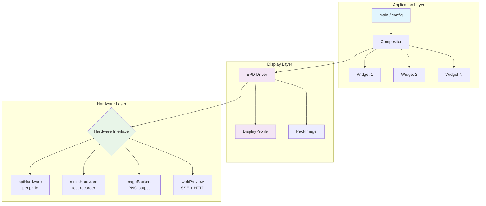
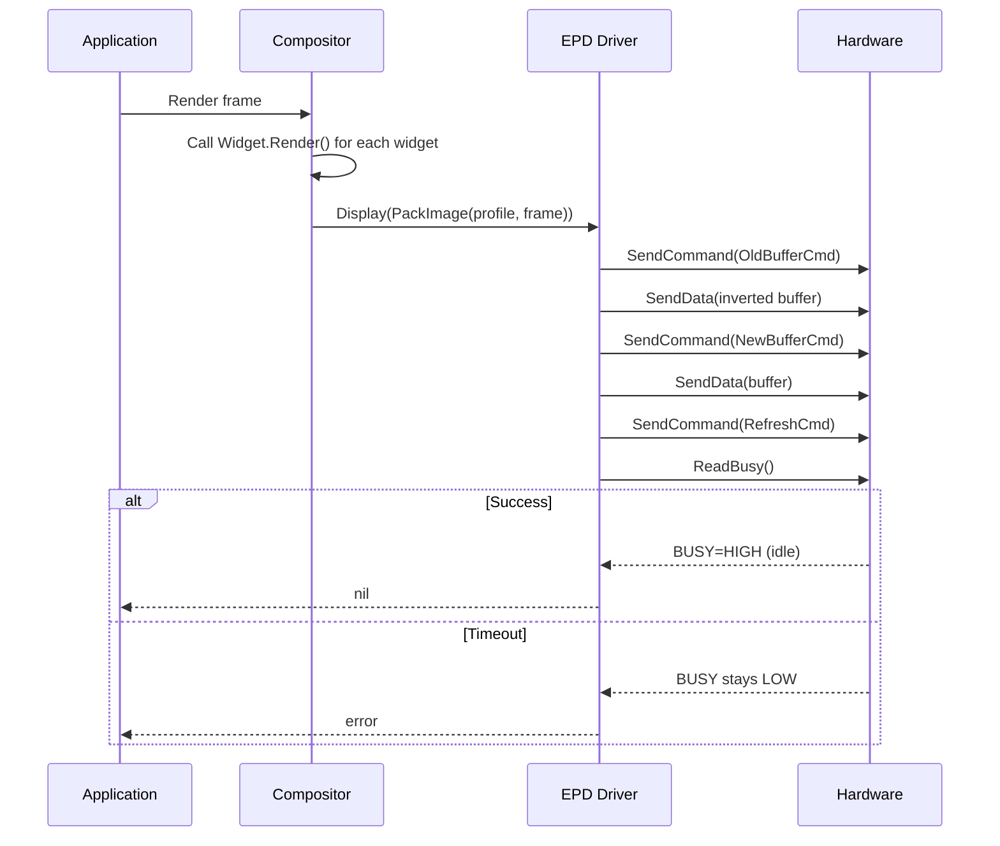
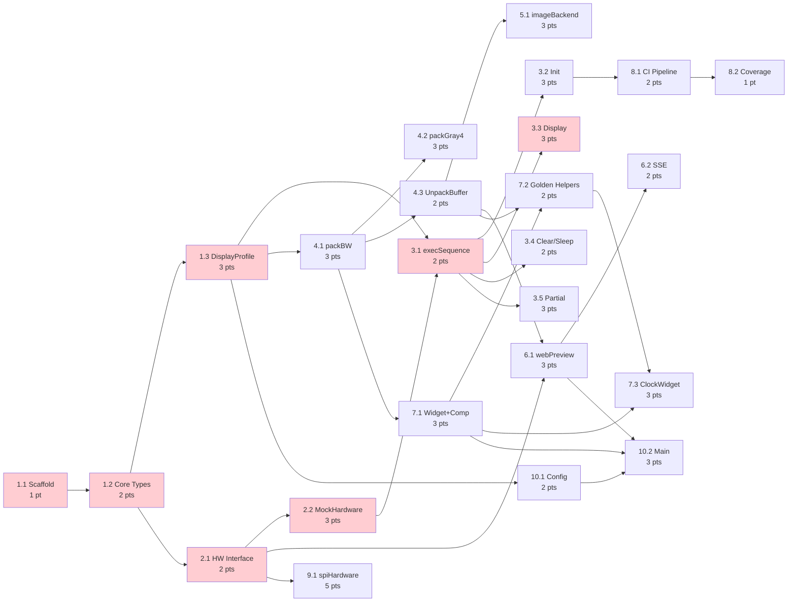

# Execution Plan: Inkwell

> **Source Documents**:
>
> - [Hardware Overview](docs/01-hardware-overview.md)
> - [Raspberry Pi Setup](docs/02-raspberry-pi-setup.md)
> - [Python Driver Architecture](docs/03-python-driver-architecture.md)
> - [Rendering Pipeline](docs/04-rendering-pipeline.md)
> - [SPI Command Reference](docs/05-spi-command-reference.md)
> - [Go Implementation Guide](docs/06-go-implementation-guide.md)
> - [Testing Strategy](docs/07-testing-strategy.md)

## Executive Summary

**Client Job**: When Grant wants to display dashboard information on a
physical e-ink display at home, he needs a Go application that drives a
Waveshare 7.5" e-Paper V2 from a Raspberry Pi Zero 2 W, so he can have a
reliable, always-on information display, avoiding the fragility of
Python-based Waveshare examples and the lack of testability they bring.

**Functional Outcome**: A Go binary that initializes the display, renders
widget-based layouts, and refreshes the e-ink panel via SPI — fully testable
without hardware through mock backends and golden file verification.

**Emotional Outcome**: Confidence that display code is correct before
deploying to the Pi, with a fast dev feedback loop via web preview.

**Social Outcome**: A well-architected open-source Go e-ink framework that
others can extend with new display profiles and widgets.

**Technical Success Criteria**:

- 100% unit test coverage on all packages (TDD mandatory)
- Data-driven display profiles — new displays require data, not code
- Four hardware backends: SPI (production), mock (tests), image (PNG),
  web preview (browser)
- Cross-compiles to `linux/arm64` with no CGO
- Commits after each successful TDD checkpoint

## Architecture Overview



### Display Update Sequence



## Milestone Breakdown

### Milestone 1: Core Foundation (Phases 1-3)

**Value Delivered**: The core display driver compiles, passes all unit tests,
and can drive any display profile through a mock backend — proving the
architecture works end-to-end without hardware.

**Client Job**: When developing the e-ink driver, Grant wants a fully tested
core layer (types, hardware interface, EPD driver) so he can build higher
layers with confidence, avoiding regressions in the SPI command sequences.

### Milestone 2: Rendering Pipeline (Phases 4-5)

**Value Delivered**: Images can be converted to display buffers and written to
PNG files — the rendering pipeline is complete and visually verifiable on any
machine.

**Client Job**: When iterating on display output, Grant wants to convert Go
images into packed display buffers and see PNG output so he can verify
rendering correctness visually, avoiding deploy-to-Pi-to-see-it cycles.

### Milestone 3: Developer Experience (Phase 6)

**Value Delivered**: A live web preview with SSE auto-refresh — the fastest
possible feedback loop for widget development.

**Client Job**: When building widgets, Grant wants a browser-based live
preview so he can see changes instantly, avoiding repeated cross-compile and
SCP cycles.

### Milestone 4: Widget System & First Widget (Phase 7)

**Value Delivered**: A working widget framework with compositor and at least
one real widget, testable via golden files.

**Client Job**: When composing a dashboard layout, Grant wants a widget system
that renders into sub-regions of the display so he can build and test widgets
independently, avoiding monolithic rendering code.

### Milestone 5: Production Ready (Phases 8-10)

**Value Delivered**: CI pipeline, real hardware backend, and application entry
point — the binary runs on the Pi.

**Client Job**: When deploying to the Pi, Grant wants a single binary with
config-driven display selection so he can ship and run the dashboard, avoiding
manual setup or Python dependencies on the Pi.

---

## Detailed Task Breakdown

### **Epic 1: Project Scaffold & Core Types**

<!-- markdownlint-disable MD013 -->

#### **Task 1.1: Initialize Go module and project structure** | Points: 1 | Risk: Low

<!-- markdownlint-enable MD013 -->

**Dependencies**: None

**JOB**: When starting a new Go project, Grant wants a clean module layout
with standard directory structure so he can begin TDD immediately, avoiding
ad-hoc file placement.

**FUNCTIONAL OUTCOME**:

- `go.mod` initialized with module path
- Directory structure: `cmd/`, `internal/inkwell/`, `internal/inkwell/testdata/`
- Empty `main.go` that compiles

**EMOTIONAL OUTCOME**: Clean slate, ready to write first test
**SOCIAL OUTCOME**: Standard Go project layout recognizable to any Go dev
**TECHNICAL OUTCOME**: `go build ./...` and `go test ./...` pass (trivially)

**Acceptance Criteria**:

- [x] **Structure**: `go mod init`, directories created, `main.go` compiles
- [x] **Verification**: `go build ./...` exits 0
- [x] **Commit**: Initial scaffold committed

---

<!-- markdownlint-disable MD013 -->

#### **Task 1.2: Define core types — Command, ColorDepth, Capabilities** | Points: 2 | Risk: Low

<!-- markdownlint-enable MD013 -->

**Dependencies**: Task 1.1

**JOB**: When building the display driver, Grant wants well-defined value
types so he can express display profiles as pure data, avoiding scattered
magic numbers.

**FUNCTIONAL OUTCOME**:

- `Command` struct: `Reg byte`, `Data []byte`
- `ColorDepth` enum: `BW`, `Gray4`, `Color7`
- `Capabilities` struct: `FastRefresh`, `PartialRefresh`, `Grayscale` bools
- `InitMode` enum: `InitFull`, `InitFast`, `InitPartial`, `Init4Gray`

**EMOTIONAL OUTCOME**: Core vocabulary established, everything has a name
**SOCIAL OUTCOME**: Self-documenting types that communicate intent
**TECHNICAL OUTCOME**: 100% test coverage on type methods and string
representations

**Acceptance Criteria**:

- [x] **TDD**: Tests written first for `ColorDepth.String()`,
  `InitMode.String()`
- [x] **Types**: All four types defined with godoc comments
- [x] **Coverage**: `go test -cover` reports 100% for this file
- [x] **Commit**: Types committed after green tests

---

<!-- markdownlint-disable MD013 -->

#### **Task 1.3: Define DisplayProfile and Waveshare 7.5" V2 profile** | Points: 3 | Risk: Low

<!-- markdownlint-enable MD013 -->

**Dependencies**: Task 1.2

**JOB**: When adding display support, Grant wants a data-only
`DisplayProfile` struct so he can add new displays without writing driver
code, avoiding per-display driver classes.

**FUNCTIONAL OUTCOME**:

- `DisplayProfile` struct with all fields from the Go Implementation Guide
- `BufferSize()` method that calculates correctly for BW, Gray4, Color7
- `Waveshare7in5V2` variable with complete init sequences from docs
- `Profiles` map for name-based lookup

**EMOTIONAL OUTCOME**: The Waveshare 7.5" V2 is fully described as data
**SOCIAL OUTCOME**: Adding a display is filling in a struct, not writing a
driver
**TECHNICAL OUTCOME**: 100% test coverage; `BufferSize()` tested for all
color depths; profile lookup tested

**Acceptance Criteria**:

- [x] **TDD**: Tests for `BufferSize()` across all `ColorDepth` values
  written first
- [x] **TDD**: Tests for `Profiles` map lookup (hit and miss) written first
- [x] **Profile Data**: Init sequences match docs/05-spi-command-reference.md
  exactly
- [x] **Coverage**: 100% on profile package
- [x] **Commit**: Profile committed after green tests

---

### **Epic 2: Hardware Interface & Mock Backend**

#### **Task 2.1: Define Hardware interface** | Points: 2 | Risk: Low

**Dependencies**: Task 1.2

**JOB**: When swapping between real hardware and test doubles, Grant wants a
clean `Hardware` interface so he can inject any backend, avoiding tight
coupling to SPI.

**FUNCTIONAL OUTCOME**:

- `Hardware` interface: `SendCommand(byte) error`, `SendData([]byte) error`,
  `ReadBusy() bool`, `Reset() error`, `Close() error`
- Interface defined in its own file with godoc

**EMOTIONAL OUTCOME**: The seam between driver and transport is explicit
**SOCIAL OUTCOME**: Any Go developer can implement a new backend
**TECHNICAL OUTCOME**: Interface compiles; no implementation yet needed for
tests

**Acceptance Criteria**:

- [x] **Interface**: All five methods defined per Go Implementation Guide
- [x] **Docs**: Godoc comments on interface and each method
- [x] **Commit**: Interface committed

---

#### **Task 2.2: Implement MockHardware (test recorder)** | Points: 3 | Risk: Low

**Dependencies**: Task 2.1

**JOB**: When testing the EPD driver, Grant wants a mock that records every
SPI call so he can assert exact command sequences, avoiding hardware
dependencies in tests.

**FUNCTIONAL OUTCOME**:

- `MockHardware` struct implementing `Hardware`
- Records calls as `[]Call` where `Call` has `Type string` and `Data []byte`
- `ReadBusy()` returns `true` by default (idle)
- Configurable: `BusyCount int` to simulate N busy reads before idle
- `Reset()` records a reset call
- Helper: `Commands() []byte` returns just the command bytes for quick
  assertions

**EMOTIONAL OUTCOME**: Writing driver tests feels easy and deterministic
**SOCIAL OUTCOME**: Test patterns are clear and reusable
**TECHNICAL OUTCOME**: 100% coverage on MockHardware itself

**Acceptance Criteria**:

- [x] **TDD**: Tests for recording SendCommand, SendData, ReadBusy, Reset
  written first
- [x] **TDD**: Test for BusyCount simulation written first
- [x] **TDD**: Test for Commands() helper written first
- [x] **Verification**: MockHardware satisfies `Hardware` interface
  (compile-time check)
- [x] **Coverage**: 100%
- [x] **Commit**: Mock committed after green tests

---

### **Epic 3: EPD Driver**

#### **Task 3.1: Implement execSequence** | Points: 2 | Risk: Low

**Dependencies**: Task 2.2, Task 1.3

**JOB**: When initializing a display, Grant wants a method that sends a
sequence of `Command` structs so he can reuse it across all init modes,
avoiding duplicated SPI send logic.

**FUNCTIONAL OUTCOME**:

- `EPD` struct with `hw Hardware` and `profile *DisplayProfile`
- `NewEPD(hw, profile)` constructor
- `execSequence([]Command) error` that sends command + data, busy-waits on
  nil-data commands
- Error propagation from Hardware methods

**EMOTIONAL OUTCOME**: Sequence execution is one method, not scattered logic
**SOCIAL OUTCOME**: The init-to-SPI mapping is transparent and auditable
**TECHNICAL OUTCOME**: 100% coverage; tested with MockHardware asserting
exact call sequences

**Acceptance Criteria**:

- [x] **TDD**: Test with a 3-command sequence (with data, without data,
  with data) written first
- [x] **TDD**: Test error propagation (SendCommand fails mid-sequence)
  written first
- [x] **Busy Wait**: Commands with `nil` Data trigger `ReadBusy()` call
- [x] **Coverage**: 100%
- [x] **Commit**: Committed after green tests

---

#### **Task 3.2: Implement Init (all modes)** | Points: 3 | Risk: Low

**Dependencies**: Task 3.1

**JOB**: When switching display modes, Grant wants `Init(mode)` to send the
correct profile sequence so he can support full, fast, partial, and grayscale
modes, avoiding manual command assembly.

**FUNCTIONAL OUTCOME**:

- `Init(mode InitMode) error` method on EPD
- Calls `Reset()` then `execSequence()` with the profile's sequence for that
  mode
- Returns error if profile doesn't support the requested mode (nil sequence)

**EMOTIONAL OUTCOME**: One call to switch modes — no ceremony
**SOCIAL OUTCOME**: Mode support is data-driven and extensible
**TECHNICAL OUTCOME**: 100% coverage; each mode tested against expected
command sequence; unsupported mode returns descriptive error

**Acceptance Criteria**:

- [x] **TDD**: Test InitFull sends reset + profile.InitFull commands
- [x] **TDD**: Test InitFast sends reset + profile.InitFast commands
- [x] **TDD**: Test InitPartial sends reset + profile.InitPartial commands
- [x] **TDD**: Test Init4Gray sends reset + profile.Init4Gray commands
- [x] **TDD**: Test unsupported mode (nil sequence) returns error
- [x] **Coverage**: 100%
- [x] **Commit**: Committed after green tests

---

#### **Task 3.3: Implement Display (full refresh)** | Points: 3 | Risk: Medium

**Dependencies**: Task 3.1

**JOB**: When updating the screen, Grant wants `Display(buffer)` to send old
(inverted) and new buffers with the correct commands so he can perform a full
refresh, avoiding manual buffer inversion.

**FUNCTIONAL OUTCOME**:

- `Display(buffer []byte) error` method
- Sends inverted buffer via `OldBufferCmd`, original via `NewBufferCmd`,
  then `RefreshCmd`
- Busy-waits after refresh command
- Validates buffer length matches `profile.BufferSize()`

**EMOTIONAL OUTCOME**: Full refresh is one call with correct polarity
handling
**SOCIAL OUTCOME**: Buffer handling matches the documented protocol exactly
**TECHNICAL OUTCOME**: 100% coverage; buffer inversion verified
byte-by-byte; wrong-size buffer rejected

**Acceptance Criteria**:

- [x] **TDD**: Test command sequence (old cmd, data, new cmd, data, refresh,
  busy) written first
- [x] **TDD**: Test buffer inversion (each byte is `^b`) written first
- [x] **TDD**: Test buffer size validation (wrong size returns error)
  written first
- [x] **Coverage**: 100%
- [ ] **Commit**: Committed after green tests

---

#### **Task 3.4: Implement Clear and Sleep** | Points: 2 | Risk: Low

**Dependencies**: Task 3.1

**JOB**: When finishing a display update cycle, Grant wants `Clear()` and
`Sleep()` methods so he can reset the screen and protect the panel, avoiding
accidental image retention damage.

**FUNCTIONAL OUTCOME**:

- `Clear() error` — sends all-white to both buffers, triggers refresh
- `Sleep() error` — executes `profile.SleepSequence`
- `Close() error` — calls Sleep then `hw.Close()`

**EMOTIONAL OUTCOME**: Display lifecycle is clean: init → display → sleep
**SOCIAL OUTCOME**: Panel safety is built into the API, not left to the caller
**TECHNICAL OUTCOME**: 100% coverage; Clear verified with correct buffer
contents; Sleep verified against profile sequence

**Acceptance Criteria**:

- [ ] **TDD**: Test Clear sends 0xFF old buffer and 0x00 new buffer
- [ ] **TDD**: Test Sleep sends profile.SleepSequence commands
- [ ] **TDD**: Test Close calls Sleep then hw.Close
- [ ] **Coverage**: 100%
- [ ] **Commit**: Committed after green tests

---

#### **Task 3.5: Implement DisplayPartial** | Points: 3 | Risk: Medium

**Dependencies**: Task 3.1

**JOB**: When updating a small region, Grant wants `DisplayPartial()` to set
the partial window and send only the affected bytes so he can do fast updates,
avoiding full-screen redraws.

**FUNCTIONAL OUTCOME**:

- `DisplayPartial(buffer []byte, x, y, w, h int) error`
- Aligns x to byte boundary (multiple of 8)
- Sends VCOM partial settings, enters partial mode, sets window coordinates,
  sends data, refreshes
- Returns error if profile doesn't support partial refresh

**EMOTIONAL OUTCOME**: Partial refresh is straightforward, byte-alignment
handled automatically
**SOCIAL OUTCOME**: Matches the documented SPI partial refresh protocol
exactly
**TECHNICAL OUTCOME**: 100% coverage; coordinate alignment tested;
unsupported mode tested; command sequence verified

**Acceptance Criteria**:

- [ ] **TDD**: Test byte-alignment of X coordinates (e.g., 13 → 8)
- [ ] **TDD**: Test partial window command byte encoding
- [ ] **TDD**: Test command sequence matches docs/04 partial refresh
- [ ] **TDD**: Test error when profile lacks partial support
- [ ] **Coverage**: 100%
- [ ] **Commit**: Committed after green tests

---

### **Epic 4: Buffer Packing**

#### **Task 4.1: Implement packBW** | Points: 3 | Risk: Low

**Dependencies**: Task 1.3

**JOB**: When converting a Go image to display format, Grant wants `packBW()`
to produce the correct 48,000-byte buffer so he can send it to the display,
avoiding manual bit manipulation.

**FUNCTIONAL OUTCOME**:

- `PackImage(profile, img) []byte` dispatcher
- `packBW()` — 8 pixels per byte, MSB first, black=1 white=0
- Handles `image.Image` input (any Go image type)

**EMOTIONAL OUTCOME**: Image-to-buffer conversion is invisible — just works
**SOCIAL OUTCOME**: Buffer format matches the Waveshare protocol documented
in docs/04
**TECHNICAL OUTCOME**: 100% coverage; tested with known pixel patterns
(all white, all black, checkerboard, single pixel)

**Acceptance Criteria**:

- [ ] **TDD**: Test all-white image produces all-zero buffer
- [ ] **TDD**: Test all-black image produces all-0xFF buffer
- [ ] **TDD**: Test single black pixel at (0,0) sets MSB of byte 0
- [ ] **TDD**: Test single black pixel at (7,0) sets LSB of byte 0
- [ ] **TDD**: Test checkerboard pattern produces expected bytes
- [ ] **TDD**: Test buffer length equals `profile.BufferSize()`
- [ ] **Coverage**: 100%
- [ ] **Commit**: Committed after green tests

---

#### **Task 4.2: Implement packGray4** | Points: 3 | Risk: Medium

**Dependencies**: Task 4.1

**JOB**: When using 4-level grayscale mode, Grant wants `packGray4()` to pack
2 bits per pixel so he can render grayscale content, avoiding manual bit-plane
splitting.

**FUNCTIONAL OUTCOME**:

- `packGray4()` — 4 pixels per byte, 2 bits each
- Maps pixel luminance to 4 levels: white (00), light gray (01),
  dark gray (10), black (11)
- Buffer size: `width * height / 4`

**EMOTIONAL OUTCOME**: Grayscale just works through the same `PackImage` API
**SOCIAL OUTCOME**: Grayscale encoding matches the documented 2-bit format
**TECHNICAL OUTCOME**: 100% coverage; tested with known grayscale values

**Acceptance Criteria**:

- [ ] **TDD**: Test all-white image produces expected buffer
- [ ] **TDD**: Test all-black image produces expected buffer
- [ ] **TDD**: Test mixed gray levels pack correctly (4 pixels → 1 byte)
- [ ] **TDD**: Test buffer length equals `profile.BufferSize()` for Gray4
- [ ] **Coverage**: 100%
- [ ] **Commit**: Committed after green tests

---

#### **Task 4.3: Implement UnpackBuffer (buffer → image)** | Points: 2 | Risk: Low

**Dependencies**: Task 4.1

**JOB**: When verifying display output visually, Grant wants `UnpackBuffer()`
to convert a raw buffer back to a Go image so he can generate PNG golden files
for code review, avoiding manual hex inspection.

**FUNCTIONAL OUTCOME**:

- `UnpackBuffer(profile, buf) *image.Paletted`
- Inverse of `packBW` — each bit becomes a black or white pixel
- Used by golden file test helpers and image backend

**EMOTIONAL OUTCOME**: Can see what the display would show as a PNG
**SOCIAL OUTCOME**: Golden file PNGs make PRs reviewable
**TECHNICAL OUTCOME**: 100% coverage; round-trip test: pack then unpack
equals original

**Acceptance Criteria**:

- [ ] **TDD**: Round-trip test — packBW then UnpackBuffer produces original
  image
- [ ] **TDD**: Test with known buffer produces expected pixel values
- [ ] **Coverage**: 100%
- [ ] **Commit**: Committed after green tests

---

### **Epic 5: Image Backend**

#### **Task 5.1: Implement imageBackend** | Points: 3 | Risk: Low

**Dependencies**: Task 4.3, Task 2.1

**JOB**: When developing without a Pi, Grant wants a backend that writes PNG
files on each `Display()` call so he can visually inspect output, avoiding
hardware-dependent iteration.

**FUNCTIONAL OUTCOME**:

- `imageBackend` implementing `Hardware` interface
- Captures `SendData` payloads after `NewBufferCmd`
- On `RefreshCmd`, unpacks buffer and writes PNG to configured directory
- Filenames include timestamp or sequence number

**EMOTIONAL OUTCOME**: Every display call produces a visible artifact
**SOCIAL OUTCOME**: Output history is saved as a sequence of PNGs
**TECHNICAL OUTCOME**: 100% coverage; tested by sending a known buffer
sequence and verifying PNG output

**Acceptance Criteria**:

- [ ] **TDD**: Test that a full Display sequence (old cmd, data, new cmd,
  data, refresh) produces a PNG file
- [ ] **TDD**: Test PNG pixel values match the sent buffer
- [ ] **TDD**: Test sequential calls produce numbered files
- [ ] **Coverage**: 100%
- [ ] **Commit**: Committed after green tests

---

### **Epic 6: Web Preview Server**

#### **Task 6.1: Implement webPreview backend** | Points: 3 | Risk: Medium

**Dependencies**: Task 4.3, Task 2.1

**JOB**: When iterating on widget rendering, Grant wants a browser-based live
preview so he can see display output instantly without restarting, avoiding
slow file-based feedback.

**FUNCTIONAL OUTCOME**:

- `webPreview` implementing `Hardware` interface
- Captures display buffer on refresh
- `GET /frame.png` — current buffer as PNG (with optional `?scale=N`)
- Thread-safe buffer updates

**EMOTIONAL OUTCOME**: Change code → see result in browser immediately
**SOCIAL OUTCOME**: Anyone on the network can view the display output
**TECHNICAL OUTCOME**: 100% coverage on buffer capture and PNG encoding;
HTTP handler tested with `httptest`

**Acceptance Criteria**:

- [ ] **TDD**: Test buffer capture from Hardware calls
- [ ] **TDD**: Test `/frame.png` returns valid PNG with correct dimensions
- [ ] **TDD**: Test `?scale=3` returns upscaled image
- [ ] **Coverage**: 100%
- [ ] **Commit**: Committed after green tests

---

#### **Task 6.2: Add SSE auto-refresh** | Points: 2 | Risk: Low

**Dependencies**: Task 6.1

**JOB**: When the display buffer updates, Grant wants the browser to
auto-refresh the preview image so he doesn't have to manually reload, avoiding
F5-driven development.

**FUNCTIONAL OUTCOME**:

- `GET /events` — SSE stream, pushes `"refresh"` on buffer update
- `GET /` — HTML page with `` and SSE listener (~20 lines)
- Subscribe/unsubscribe pattern for multiple browser tabs

**EMOTIONAL OUTCOME**: The preview is alive — it updates as code runs
**SOCIAL OUTCOME**: Demo-ready: open in a browser and show people
**TECHNICAL OUTCOME**: 100% coverage; SSE tested with `httptest` recorder;
subscribe/unsubscribe race-condition safe

**Acceptance Criteria**:

- [ ] **TDD**: Test SSE endpoint sends event on buffer update
- [ ] **TDD**: Test HTML page endpoint returns valid HTML with EventSource JS
- [ ] **TDD**: Test multiple subscribers receive events
- [ ] **TDD**: Test unsubscribe on client disconnect
- [ ] **Coverage**: 100%
- [ ] **Commit**: Committed after green tests

---

### **Epic 7: Widget System**

#### **Task 7.1: Define Widget interface and Compositor** | Points: 3 | Risk: Low

**Dependencies**: Task 4.1

**JOB**: When building a multi-widget dashboard, Grant wants a compositor that
collects widgets and renders them into a single frame so he can compose
layouts, avoiding manual image stitching.

**FUNCTIONAL OUTCOME**:

- `Widget` interface: `Bounds() image.Rectangle`,
  `Render(frame *image.Paletted) error`
- `Compositor` struct: holds `[]Widget` and profile reference
- `Compositor.Render() (*image.Paletted, error)` — creates frame, calls each
  widget's Render
- Widgets render into sub-regions; compositor owns the full frame

**EMOTIONAL OUTCOME**: Adding a widget = implementing an interface, drop it in
**SOCIAL OUTCOME**: Clean separation between widgets and display logic
**TECHNICAL OUTCOME**: 100% coverage; compositor tested with stub widgets
that draw known patterns

**Acceptance Criteria**:

- [ ] **TDD**: Test compositor with zero widgets produces blank frame
- [ ] **TDD**: Test compositor with one stub widget renders in correct bounds
- [ ] **TDD**: Test compositor with two non-overlapping widgets renders both
- [ ] **TDD**: Test widget render error propagates
- [ ] **Coverage**: 100%
- [ ] **Commit**: Committed after green tests

---

#### **Task 7.2: Golden file test helpers** | Points: 2 | Risk: Low

**Dependencies**: Task 4.3, Task 7.1

**JOB**: When verifying widget output, Grant wants `assertGolden()` and
`-update` flag helpers so he can use golden file testing ergonomically,
avoiding boilerplate in every test.

**FUNCTIONAL OUTCOME**:

- `var Update = flag.Bool("update", false, "update golden files")`
- `AssertGoldenBuffer(t, buf)` — compares raw bytes to
  `testdata/TestName.bin`
- `AssertGoldenPNG(t, img)` — saves PNG alongside for visual review
- On `-update`, writes new golden files and returns early

**EMOTIONAL OUTCOME**: Golden file tests are one-liners
**SOCIAL OUTCOME**: PR diffs show PNG changes visually
**TECHNICAL OUTCOME**: 100% coverage; tested with temp directories

**Acceptance Criteria**:

- [ ] **TDD**: Test assertGolden passes when file matches
- [ ] **TDD**: Test assertGolden fails when file differs
- [ ] **TDD**: Test -update flag writes new file
- [ ] **TDD**: Test PNG companion file is created
- [ ] **Coverage**: 100%
- [ ] **Commit**: Committed after green tests

---

#### **Task 7.3: Implement first widget (ClockWidget)** | Points: 3 | Risk: Medium

**Dependencies**: Task 7.1, Task 7.2

**JOB**: When displaying the time on the dashboard, Grant wants a
`ClockWidget` that renders a digital clock so he can verify the full pipeline
end-to-end, avoiding a pipeline that's never been exercised with real content.

**FUNCTIONAL OUTCOME**:

- `ClockWidget` implementing `Widget`
- Configurable: position, size, time source (injectable for testing)
- Renders time text using `golang.org/x/image/font`
- Embedded default font (Go's built-in or a bundled TTF)

**EMOTIONAL OUTCOME**: The first real thing appears on the display
**SOCIAL OUTCOME**: Demonstrates the full render pipeline working
**TECHNICAL OUTCOME**: 100% coverage; golden file tests with fixed time;
font rendering is deterministic

**Acceptance Criteria**:

- [ ] **TDD**: Golden file test with fixed time "14:30" written first
- [ ] **TDD**: Test Bounds() returns configured rectangle
- [ ] **TDD**: Test Render draws non-blank output in bounds
- [ ] **TDD**: Test with different time values produces different output
- [ ] **Coverage**: 100%
- [ ] **Commit**: Committed after green tests

---

### **Epic 8: CI & Cross-Compilation**

#### **Task 8.1: GitHub Actions CI pipeline** | Points: 2 | Risk: Low

**Dependencies**: Task 3.2 (needs tests to exist)

**JOB**: When pushing code, Grant wants automated test and build verification
so he can catch regressions immediately, avoiding broken main branch.

**FUNCTIONAL OUTCOME**:

- `.github/workflows/ci.yml`
- Jobs: `go test ./...`, `go vet ./...`, cross-compile check
  (`GOOS=linux GOARCH=arm64 go build ./...`)
- Go 1.24, runs on `ubuntu-latest`

**EMOTIONAL OUTCOME**: Green badge = confidence
**SOCIAL OUTCOME**: Contributors see the project has CI
**TECHNICAL OUTCOME**: All tests pass in CI without hardware

**Acceptance Criteria**:

- [ ] **Pipeline**: Test, vet, and cross-compile jobs defined
- [ ] **Verification**: Pipeline passes on push
- [ ] **Commit**: CI config committed

---

#### **Task 8.2: Add coverage enforcement** | Points: 1 | Risk: Low

**Dependencies**: Task 8.1

**JOB**: When reviewing PRs, Grant wants CI to enforce 100% test coverage so
he can maintain the TDD discipline, avoiding coverage erosion over time.

**FUNCTIONAL OUTCOME**:

- CI step: `go test -coverprofile=coverage.out ./...`
- Coverage check script or `go tool cover` threshold validation
- Fail CI if coverage drops below 100% on non-hardware-tagged packages

**EMOTIONAL OUTCOME**: Coverage can't silently regress
**SOCIAL OUTCOME**: 100% badge on the README (when ready)
**TECHNICAL OUTCOME**: Enforced via CI, not honor system

**Acceptance Criteria**:

- [ ] **CI**: Coverage step added to workflow
- [ ] **Threshold**: Fails if below 100% on testable packages
- [ ] **Commit**: Committed

---

### **Epic 9: SPI Hardware Backend**

#### **Task 9.1: Implement spiHardware with periph.io** | Points: 5 | Risk: High

**Dependencies**: Task 2.1

**JOB**: When running on the Pi, Grant wants a `spiHardware` backend that
uses periph.io for real SPI/GPIO so he can drive the physical display,
avoiding Python or C dependencies.

**FUNCTIONAL OUTCOME**:

- `spiHardware` implementing `Hardware`, build-tagged `//go:build hardware`
- Uses `periph.io/x/host/v3`, `periph.io/x/conn/v3`
- GPIO pins: RST=17, DC=25, CS=8, BUSY=24, PWR=18
- SPI: bus 0, device 0, 4 MHz, mode 0
- `ReadBusy()` polls with timeout
- `Reset()` pulse sequence per docs
- `Close()` powers down display and cleans up

**EMOTIONAL OUTCOME**: The Go binary drives the real display
**SOCIAL OUTCOME**: Pure Go, no CGO — trivial cross-compilation
**TECHNICAL OUTCOME**: Build-tagged so it doesn't break CI on non-Pi;
tested on Pi with `-tags hardware`

**Acceptance Criteria**:

- [ ] **Build Tag**: Only compiles with `-tags hardware`
- [ ] **GPIO**: Pin assignments match docs/01-hardware-overview.md
- [ ] **SPI**: 4 MHz, Mode 0, MSB first
- [ ] **Reset**: Pulse sequence matches docs/03 (HIGH→LOW→HIGH with delays)
- [ ] **Busy**: Polls with configurable timeout
- [ ] **Close**: Powers off display (PWR pin LOW), closes SPI
- [ ] **Commit**: Committed

---

### **Epic 10: Application Entry Point**

#### **Task 10.1: Config loading (YAML)** | Points: 2 | Risk: Low

**Dependencies**: Task 1.3

**JOB**: When deploying Inkwell, Grant wants a YAML config file to select the
display profile and backend so he can switch between preview and production
without recompiling, avoiding hardcoded settings.

**FUNCTIONAL OUTCOME**:

- `inkwell.yaml` config format: `display`, `backend` (preview/image/spi),
  `preview.port`, `image.output_dir`
- Config struct with defaults
- Profile lookup from `Profiles` map

**EMOTIONAL OUTCOME**: One config file controls everything
**SOCIAL OUTCOME**: Config format is simple and documented
**TECHNICAL OUTCOME**: 100% coverage; tested with valid/invalid configs

**Acceptance Criteria**:

- [ ] **TDD**: Test valid config parses correctly
- [ ] **TDD**: Test unknown display profile returns error
- [ ] **TDD**: Test defaults applied for missing fields
- [ ] **Coverage**: 100%
- [ ] **Commit**: Committed after green tests

---

#### **Task 10.2: Main entry point and wiring** | Points: 3 | Risk: Medium

**Dependencies**: Task 10.1, Task 6.1, Task 7.1

**JOB**: When running `inkwell`, Grant wants the binary to load config, select
backend, init display, compose widgets, and render so the full application
works end-to-end, avoiding manual wiring.

**FUNCTIONAL OUTCOME**:

- `cmd/inkwell/main.go` — loads config, creates backend, creates EPD,
  creates compositor, runs render loop
- `cmd/preview/main.go` — preview-specific entry point (optional)
- Graceful shutdown on SIGINT/SIGTERM
- Render loop: compose → pack → display → sleep interval

**EMOTIONAL OUTCOME**: `go run ./cmd/inkwell` and it works
**SOCIAL OUTCOME**: Standard Go CLI patterns
**TECHNICAL OUTCOME**: Integration test with mock backend verifying full
lifecycle

**Acceptance Criteria**:

- [ ] **TDD**: Test wiring with mock backend — init, render, sleep, close
- [ ] **Lifecycle**: Graceful shutdown tested
- [ ] **Preview**: `cmd/preview` starts web server
- [ ] **Coverage**: 100% on wiring logic
- [ ] **Commit**: Committed after green tests

---

## Parallel Work Streams

**Team Size**: 1 developer (solo project, worked on incrementally over weeks)

**Sprint Model**: Not time-boxed sprints — progress tracked by milestone
completion. Each "session" picks up the next unchecked task.

**Total Points**: 51 across 10 phases

### Stream A: Core Pipeline (Critical Path)

Tasks: 1.1 → 1.2 → 1.3 → 2.1 → 2.2 → 3.1 → 3.2 → 3.3 → 3.4 → 3.5
**Points**: 26 | **Critical Path**: YES

### Stream B: Rendering (branches from 1.3)

Tasks: 4.1 → 4.2 → 4.3 → 5.1
**Points**: 11 | **Can start after**: Task 1.3

### Stream C: Dev Experience (branches from 4.3 + 2.1)

Tasks: 6.1 → 6.2
**Points**: 5 | **Can start after**: Task 4.3

### Stream D: Widgets (branches from 4.1)

Tasks: 7.1 → 7.2 → 7.3
**Points**: 8 | **Can start after**: Task 4.1

### Stream E: CI (branches from 3.2)

Tasks: 8.1 → 8.2
**Points**: 3 | **Can start after**: Task 3.2

### Stream F: Production (late-stage)

Tasks: 9.1, 10.1 → 10.2
**Points**: 10 | **Can start after**: Milestone 3

### Dependency Graph



## Risk Assessment & Mitigation

### High-Risk Dependencies

- **Real hardware (Task 9.1)**: Risk of periph.io incompatibilities or
  SPI timing issues on Pi Zero 2 W
  - *Mitigation*: All logic is tested via mock; hardware task is isolated
    and late in the plan. Can test with the Python driver as a reference
    baseline.

### Medium-Risk Areas

- **Buffer polarity/inversion (Tasks 3.3, 4.1)**: Risk of getting the
  XOR inversion or bit ordering wrong — display shows inverted or
  garbled image
  - *Mitigation*: Golden file tests with known pixel patterns. Unpack
    and visually inspect via image backend. Reference Python driver
    `getbuffer()` byte-for-byte.

- **Partial refresh coordinates (Task 3.5)**: Risk of byte-alignment
  math errors causing corrupted partial updates
  - *Mitigation*: Exhaustive TDD with edge cases (x=0, x=7, x=8,
    x=799). Compare command bytes against Python driver output.

- **Font rendering determinism (Task 7.3)**: Risk of
  `golang.org/x/image/font` producing slightly different output across
  platforms, breaking golden files
  - *Mitigation*: Use bitmap/fixed-size fonts for initial widget. If
    platform variance appears, use font hinting options or switch to
    embedded bitmap font.

### Low-Risk Areas

- **Core types and profiles (Tasks 1.x)**: Pure data structures with no
  external dependencies
- **Mock hardware (Task 2.2)**: In-memory recorder, no side effects
- **CI pipeline (Task 8.x)**: Standard GitHub Actions Go setup

## Deployment Strategy

### Development (Milestones 1-4)

All development uses mock or preview backends on the dev machine:

```bash
# Run tests
go test ./...

# Visual preview
go run ./cmd/preview/
# Open http://localhost:8080
```

### First Hardware Deploy (Milestone 5)

```bash
# Cross-compile
GOOS=linux GOARCH=arm64 go build -tags hardware -o inkwell ./cmd/inkwell/

# Deploy
scp inkwell pi@<ip>:~/
ssh pi@<ip> './inkwell -test-hardware'
```

### Rollback Plan

1. **Immediate**: SSH to Pi, kill process, display enters safe sleep state
2. **Display stuck**: Hardware reset via GPIO (RST pin pulse) or power cycle
3. **Binary issues**: SCP previous binary back

### Production (Post-Milestone 5)

- Systemd service for auto-start
- Future: Tailscale + tsnet for remote management

## Success Metrics

### Technical Metrics

- 100% unit test coverage on all non-hardware packages
- Cross-compilation succeeds with zero CGO
- All golden file tests pass on macOS and Linux

### Functional Metrics

- Display shows correct output matching golden file PNGs
- Full refresh completes in ~4 seconds
- Partial refresh completes in ~0.4 seconds
- Web preview updates in <100ms

### Project Health Metrics

- Every task has a commit with passing tests
- No task merged without 100% coverage
- Architecture supports adding a new display by data alone

## Post-Launch Considerations

### Future Enhancements

- Additional widgets: calendar, weather, transit, Todoist
- Plugin system for third-party widgets
- Tailscale tsnet integration for remote management
- Multiple display profile support (other Waveshare sizes)
- Partial refresh scheduler (track refresh count, auto full-refresh)

### Success Definition

The project is considered successful when the Go binary runs on the Pi Zero
2 W, drives the Waveshare 7.5" V2 display with a widget-based dashboard,
and the entire rendering pipeline is verified by automated tests that run
without hardware.

---

## Quick Progress Tracker

Copy this to track completion session by session:

### Milestone 1: Core Foundation

- [ ] **1.1** — Go module scaffold
- [ ] **1.2** — Core types (Command, ColorDepth, Capabilities, InitMode)
- [ ] **1.3** — DisplayProfile + Waveshare 7.5" V2 profile
- [ ] **2.1** — Hardware interface
- [ ] **2.2** — MockHardware
- [ ] **3.1** — execSequence
- [ ] **3.2** — Init (all modes)
- [ ] **3.3** — Display (full refresh)
- [ ] **3.4** — Clear + Sleep
- [ ] **3.5** — DisplayPartial

### Milestone 2: Rendering Pipeline

- [ ] **4.1** — packBW
- [ ] **4.2** — packGray4
- [ ] **4.3** — UnpackBuffer

### Milestone 3: Image Backend + Web Preview

- [ ] **5.1** — imageBackend (PNG output)
- [ ] **6.1** — webPreview backend
- [ ] **6.2** — SSE auto-refresh

### Milestone 4: Widget System

- [ ] **7.1** — Widget interface + Compositor
- [ ] **7.2** — Golden file test helpers
- [ ] **7.3** — ClockWidget

### Milestone 5: Production Ready

- [ ] **8.1** — GitHub Actions CI
- [ ] **8.2** — Coverage enforcement
- [ ] **9.1** — spiHardware (periph.io)
- [ ] **10.1** — Config loading (YAML)
- [ ] **10.2** — Main entry point + wiring
