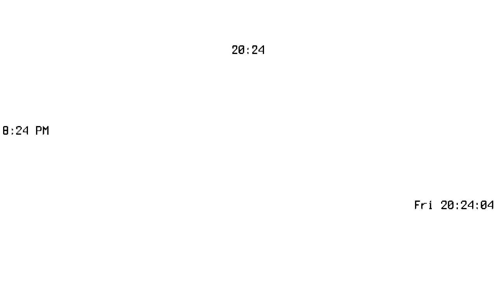

# Clock Widget

Renders the current time into a region of the frame, re-formatted on every
render. Registered under the dashboard `type: clock`.

The time is drawn in IBM Plex Mono **Bold 16pt** as solid black on a white
background, so it survives both the `bw` threshold and the `gray4`
quantization cleanly (see the rendering rules in the repository
[`CLAUDE.md`](../../../../CLAUDE.md)).

## Screenshot

Device view (`bw`) showing three clocks with different `format`/`align`
values — centered `15:04`, left-aligned `3:04 PM`, and right-aligned
`Mon 15:04:05`:



## Configuration

Top-level keys (`type`, `bounds`, `refresh`) are required by every widget;
`refresh` is the render cadence (a duration `>= 1m`, or `"static"`). A clock
typically uses `refresh: "1m"`.

The widget-specific keys live under `config:`.

<!-- markdownlint-disable MD013 -->
| Key      | Type   | Default   | Description                                                                                  |
|----------|--------|-----------|----------------------------------------------------------------------------------------------|
| `format` | string | `"15:04"` | Go [time layout](https://pkg.go.dev/time#pkg-constants) string. Must not be empty.           |
| `align`  | string | `"center"`| Horizontal alignment within `bounds`: `"center"`, `"left"`, or `"right"`. Left/right inset 4px.|
<!-- markdownlint-enable MD013 -->

Any other type for `format`/`align`, an empty `format`, or an `align` value
outside the three accepted strings is a configuration error.

## Example

```yaml
- type: clock
  bounds: [700, 0, 800, 50]
  refresh: "1m"
  config:
    format: "15:04"
    align: right
```
