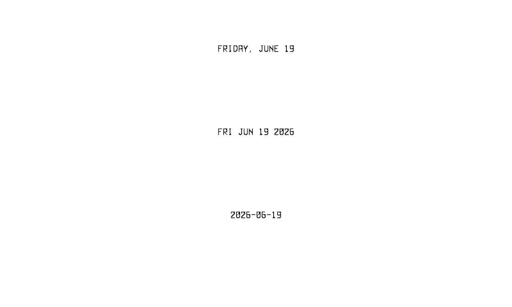

# Date Widget

Renders the current date as an **uppercased** formatted string, centered
within its bounds. Registered under the dashboard `type: date`.

The text is drawn in IBM Plex Mono **SemiBold 12pt** as solid black on a
white background. SemiBold (rather than Regular) is used deliberately:
Regular's 1px stems fragment under the `bw` threshold at this size — see the
font rules in the repository [`CLAUDE.md`](../../../../CLAUDE.md).

## Screenshot

Device view (`bw`) showing three `format` strings —
`Monday, January 2`, `Mon Jan 2 2006`, and `2006-01-02`:



## Configuration

Top-level keys (`type`, `bounds`, `refresh`) are required by every widget.
Because the date only rolls over at midnight, `refresh: "24h"` is the natural
cadence.

The widget-specific keys live under `config:`.

<!-- markdownlint-disable MD013 -->
| Key      | Type   | Default                | Description                                                                          |
|----------|--------|------------------------|--------------------------------------------------------------------------------------|
| `format` | string | `"Monday, January 2"`  | Go [time layout](https://pkg.go.dev/time#pkg-constants) string. Must not be empty. Output is uppercased before drawing. |
<!-- markdownlint-enable MD013 -->

A non-string or empty `format` is a configuration error.

## Example

```yaml
- type: date
  bounds: [0, 0, 800, 50]
  refresh: "24h"
  config:
    format: "Monday, January 2"
```
