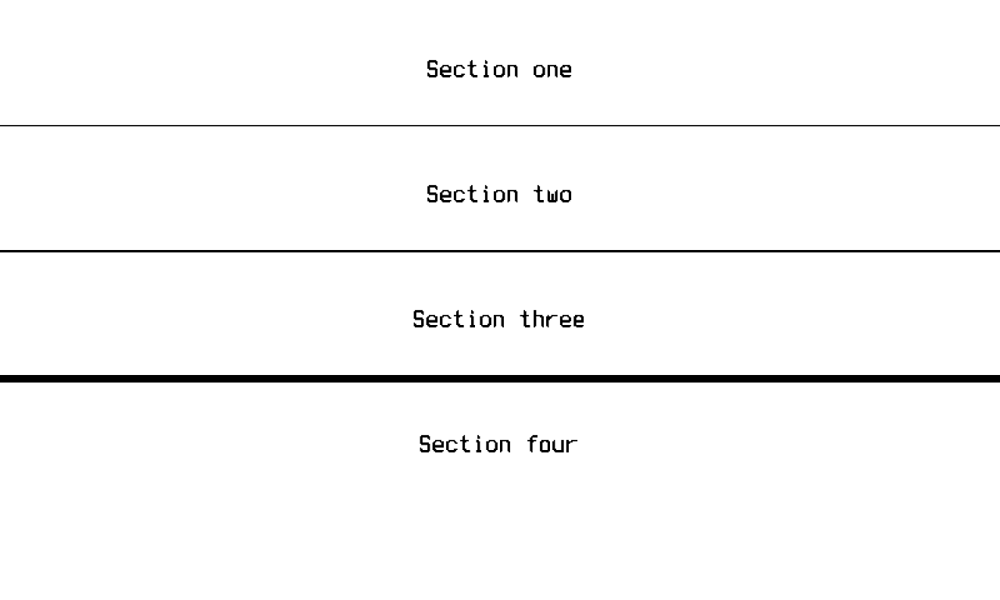

# Separator Widget

Draws a solid horizontal divider across the full width of its bounds,
anchored to the **bottom** of the region. Registered under the dashboard
`type: separator`.

Every row of the bar renders in solid `PaperBlack`. The `bw` packer
threshold-snaps (there is no dither), so a "soft" gray rule would simply
disappear — the separator is therefore a solid bar that reads identically on
both `bw` and `gray4`. See the rendering rules in the repository
[`CLAUDE.md`](../../../../CLAUDE.md).

## Screenshot

Device view (`bw`) showing dividers of thickness `1`, `2`, and `6` between
labeled sections:



## Configuration

Top-level keys (`type`, `bounds`, `refresh`) are required by every widget. A
separator never changes, so it should use `refresh: "static"` — that keeps it
from ever opening the per-screen refresh gate.

The bar is drawn at the bottom of `bounds`, so size the region's height to at
least `thickness` and place the rule with `bounds`, not with extra padding.

The widget-specific keys live under `config:`.

<!-- markdownlint-disable MD013 -->
| Key         | Type    | Default | Description                                                                 |
|-------------|---------|---------|-----------------------------------------------------------------------------|
| `thickness` | integer | `2`     | Height of the bar in pixels. Must be positive. A float (e.g. `2.0`) is accepted and truncated to an integer. |
<!-- markdownlint-enable MD013 -->

A non-numeric `thickness`, or a value `<= 0`, is a configuration error.

## Example

```yaml
- type: separator
  bounds: [0, 50, 800, 52]
  refresh: "static"
  config:
    thickness: 2
```
