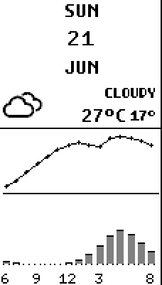
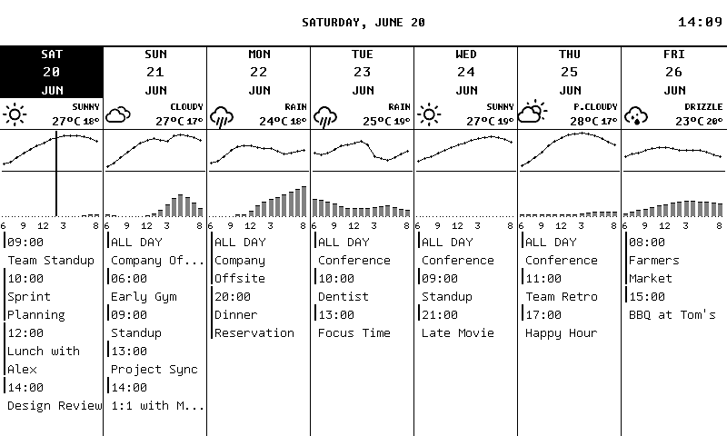

# Weatherview Component

`weatherview` is a **reusable rendering component**, not a standalone
dashboard widget — there is no `type: weatherview`. It draws a single day's
weather summary and is consumed by the
[`weekly-calendar`](../weekly/README.md) widget, once per day column. It is
documented here so the rendering it produces (and the knobs it exposes) are
discoverable alongside the widgets.

It renders using the bundled **Weather Icons** font (`weathericons.ttf`) for
the condition glyph and IBM Plex Mono for text.

## What it draws

A day cell, top to bottom:

1. **Condition row** — a weather icon flush-left, with an optional condition
   label (`CLOUDY`, `DRIZZLE`, …) and the hi/lo temperatures right-aligned to
   the cell's right edge, so the icon and the text bookend the column.
2. A horizontal divider (solid `PaperBlack`).
3. **Hourly chart** — a temperature curve across the day, precipitation bars
   beneath it, and an hour axis (`6 9 12 3 8`). The current hour is
   highlighted on today's column.

### Screenshots

A single day cell (`gray4`), cropped from the dashboard — header, condition
icon + label, hi/lo temps, hourly temperature curve, and precipitation bars
with the hour axis:

In context, one cell per day across the weekly dashboard. The precipitation
bars land on `PaperGray70` so they read as dark gray on `gray4` and solid
black under the `bw` threshold:

## Configuration

Weatherview has **no YAML config of its own**. Its behavior is driven
programmatically by the weekly-calendar widget through the exported `Options`
struct, populated from that widget's `config:` block:

<!-- markdownlint-disable MD013 -->
| `Options` field | Source (weekly-calendar config) | Description                                                        |
|-----------------|----------------------------------|--------------------------------------------------------------------|
| `TempUnit`      | `temp_unit`                      | `"C"` or `"F"`; selects the temperature unit and conversion.       |
| `ShowLabel`     | `show_weather_label`             | Whether to draw the condition label above the temps.               |
| `GlobalTempMin` | computed (`GlobalTempRange`)     | Shared y-axis minimum so all day curves are normalized together.   |
| `GlobalTempMax` | computed (`GlobalTempRange`)     | Shared y-axis maximum.                                             |
| `HighlightHour` | current hour (`now.Hour()`)      | Hour to highlight on today's chart.                                |
| `IsToday`       | computed per column              | Enables the current-hour highlight on the matching column.         |
| `IconSize`      | defaulted (`0` → auto)           | Icon size in px; `0` auto-sizes to `min(24, width/3)`.             |
<!-- markdownlint-enable MD013 -->

So `temp_unit`, `show_weather`, and `show_weather_label` on the weekly-calendar
widget are the user-facing controls for this component.

## Public API

- `RenderDayWeather(frame, bounds, day, opts)` — draw a full day cell.
- `RenderHourlyChart(frame, bounds, hourly, chartOpts)` — just the chart.
- `DrawIcon(frame, x, y, size, condition)` — just the condition glyph.
- `GlobalTempRange(days)` — compute the shared min/max for chart normalization.
