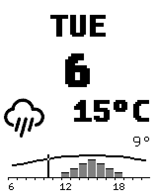
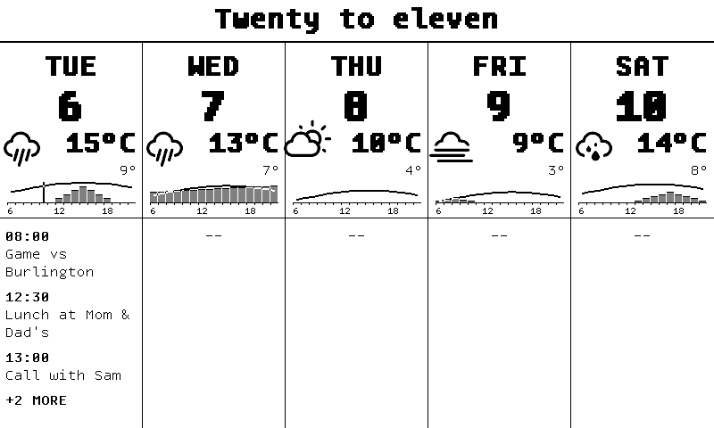

# Weatherview Component

`weatherview` is a **reusable rendering component**, not a standalone
dashboard widget — there is no `type: weatherview`. It draws a single day's
weather summary and is consumed by the
[`weekly-calendar`](../weekly/README.md) widget, once per day column. It is
documented here so the rendering it produces (and the knobs it exposes) are
discoverable alongside the widgets.

It renders using the bundled **Weather Icons** font (`weathericons.ttf`) for
the condition glyph and IBM Plex Mono for text.

## What it draws

A day cell, top to bottom:

1. **Condition row** — a weather icon flush-left, with an optional condition
   label (`CLOUDY`, `DRIZZLE`, …) and the hi/lo temperatures right-aligned to
   the cell's right edge, so the icon and the text bookend the column.
2. A horizontal divider (solid `PaperBlack`).
3. **Hourly chart** — a temperature curve across the day, precipitation bars
   beneath it, and an hour axis (`6 9 12 3 8`). The current hour is
   highlighted on today's column.

### Screenshots

A single day cell (`gray4`), cropped from the dashboard — header, condition
icon + label, hi/lo temps, hourly temperature curve, and precipitation bars
with the hour axis:

In context, one cell per day across the weekly dashboard. The precipitation
bars land on `PaperGray70` so they read as dark gray on `gray4` and solid
black under the `bw` threshold:

### Combined chart

`RenderCombinedChart` is a second renderer beside `RenderHourlyChart`, used by
the redesigned screens (bold-five, today-hero and row-agenda). It draws
precipitation bars with the temperature line over them, and gives the bars far
more height than the split chart does — in a 114 px day column the split chart
leaves them about 20 px tall, which reads as a grey smudge at any distance.

It is deliberately **not** used by `weekly-calendar`: the live weekly view
keeps `RenderHourlyChart` exactly as it is.

- **Hours 06:00–21:00 inclusive**, one hour wider than the live chart so an
  evening shower lands on the chart rather than off the end of it.
- **Hour axis `6 12 18`** — 24-hour marks matching the `format: "15:04"` the
  rest of the panel is set in, rather than the live chart's `6 9 12 3 8`,
  which mixes morning and afternoon on one axis.
- **The caller supplies only the rect.** The chart takes its own band for the
  hour labels at the bottom of the cell, sized from its own label face, so one
  renderer serves a 312 px hero cell and a 106 px row badge.
- **One range per screen, and it is required.** The caller computes a shared
  `TempRange` (°C) across every day it shows (`GlobalTempRange` is the starting
  point) and hands the same range to each chart, so a cold day sits lower than
  a warm one. The warmest value in the range touches the top of the plot and
  the coldest the row above the baseline; temperatures outside it clamp to the
  edge, and a collapsed range widens to one degree.
- **The line is black over paper and white over a bar.** Each pixel is chosen
  from what is already drawn underneath it — bar fill, bar cap or now marker
  give a white pixel, bare paper a black one — so the same rule reads in BW
  (solid black bar, white line) and Gray4 (dark-gray bar, white line) without
  asking which mode is active. The line is 2 px thick. `DrawContrastLine`
  exposes the rule for other drawing code that lays a line over its own fills.
- **A dry day is never blank.** Below a 15% peak across the window the bars
  are dropped, since a flat row of stubs reads as a broken widget, but the
  baseline, ticks and line are still drawn. Absent data (no hourly points in
  the window) draws nothing.

<!-- markdownlint-disable MD013 -->
| `CombinedOptions` field     | Description                                                       |
|-----------------------------|-------------------------------------------------------------------|
| `NowHour` / `ShowNowMarker` | Draws a 2 px solid `PaperBlack` stroke at the current hour.       |
<!-- markdownlint-enable MD013 -->

### Shared pieces

The redesigned screens draw their weather badges from the same parts, so a day
reads the same on every screen:

- `DrawIcon` draws the condition glyph. A glyph that will not draw is logged
  and the rest of the cell carries on, so callers have no error to handle.
- `NewHighLow(day, unit)` writes a day's high and low rounded in the
  configured unit: `High()` is `17°C`, `Low()` is `9°`, and `Pair()` is
  `17° 9°` for a cell too narrow to name the unit.

## Configuration

Weatherview has **no YAML config of its own**. Its behavior is driven
programmatically by the weekly-calendar widget through the exported `Options`
struct, populated from that widget's `config:` block:

<!-- markdownlint-disable MD013 -->
| `Options` field | Source (weekly-calendar config) | Description                                                        |
|-----------------|----------------------------------|--------------------------------------------------------------------|
| `TempUnit`      | `temp_unit`                      | `"C"` or `"F"`; selects the temperature unit and conversion.       |
| `ShowLabel`     | `show_weather_label`             | Whether to draw the condition label above the temps.               |
| `GlobalTempMin` | computed (`GlobalTempRange`)     | Shared y-axis minimum so all day curves are normalized together.   |
| `GlobalTempMax` | computed (`GlobalTempRange`)     | Shared y-axis maximum.                                             |
| `HighlightHour` | current hour (`now.Hour()`)      | Hour to highlight on today's chart.                                |
| `IsToday`       | computed per column              | Enables the current-hour highlight on the matching column.         |
| `IconSize`      | defaulted (`0` → auto)           | Icon size in px; `0` auto-sizes to `min(24, width/3)`.             |
<!-- markdownlint-enable MD013 -->

So `temp_unit`, `show_weather`, and `show_weather_label` on the weekly-calendar
widget are the user-facing controls for this component.

## Public API

- `RenderDayWeather(frame, bounds, day, opts)` — draw a full day cell.
- `RenderHourlyChart(frame, bounds, hourly, chartOpts)` — just the chart.
- `RenderCombinedChart(frame, bounds, hourly, rng, combinedOpts)` — bars with
  the temperature line over them (see above).
- `DrawContrastLine(frame, points)` — a 2 px line, black over paper and white
  over anything drawn.
- `DrawIcon(frame, x, y, size, condition)` — just the condition glyph.
- `NewHighLow(day, unit)` — the day's high and low as text.
- `GlobalTempRange(days)` — compute the shared min/max for chart normalization.
